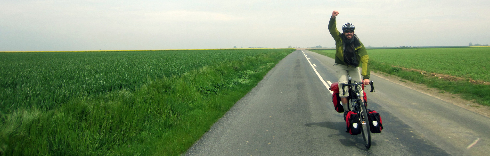

Hi, I'm Fabio:

✅ Software Engineer

✅ Conference Speaker

✅ Organizer of .

✅ Organizer of the Kubernetes Community Days Amsterdam .

I specialize in architectures for distributed Reactive Systems, bridging application level and cloud orchestrators like Kubernetes.
I love speaking about the importance of integration between application logic and infrastructure, and have done so at many
conferences (like the **O'Reilly Software Architecture Conference** and the **Reactive Summit**). 

Please check a list of [my talks](http://ticofab.io/talks/) and my full [resume](http://ticofab.io/assets/cv/fabio_tiriticco_cv_2019.pdf).

An [email](mailto:fabio@ticofab.io) is the easiest way to start a rich conversation.

**Tools of the trade:**

* Scala / Java
* Akka
* Streaming technologies
* Spark
* Kafka

When not in front of a screen, I enjoy long distance bike rides and guitar fingerpicking.

