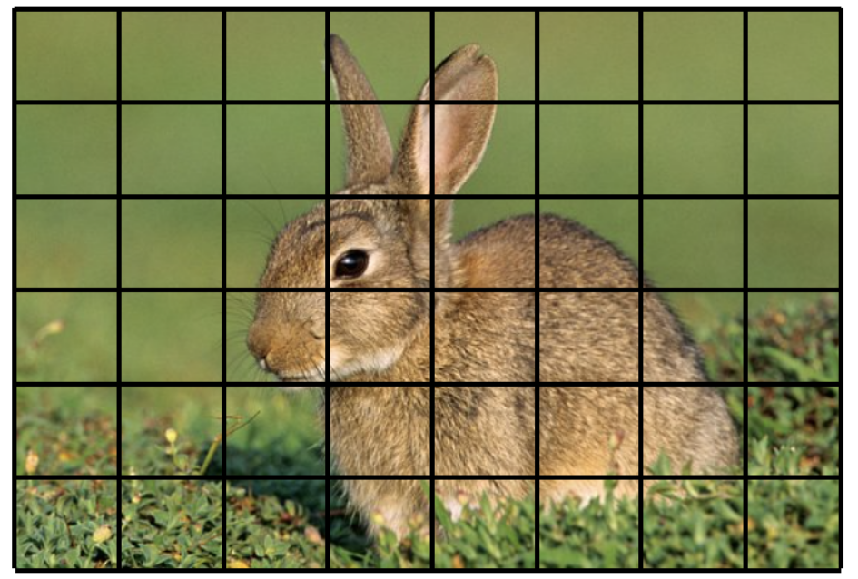
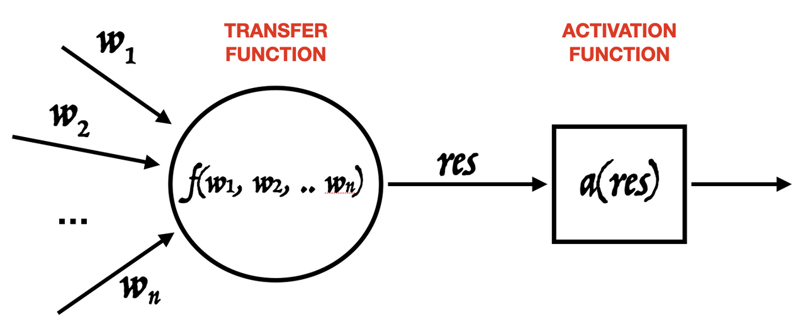
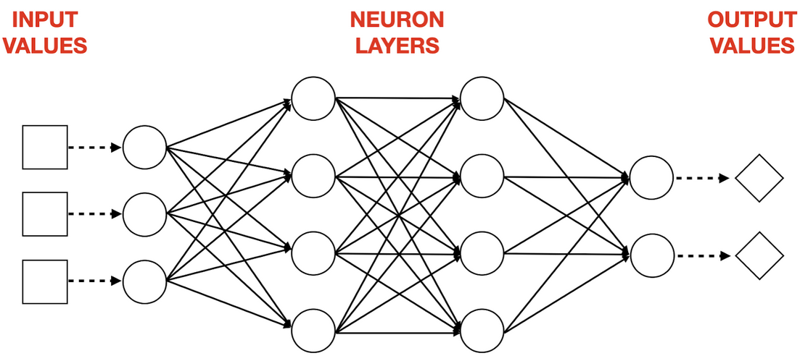
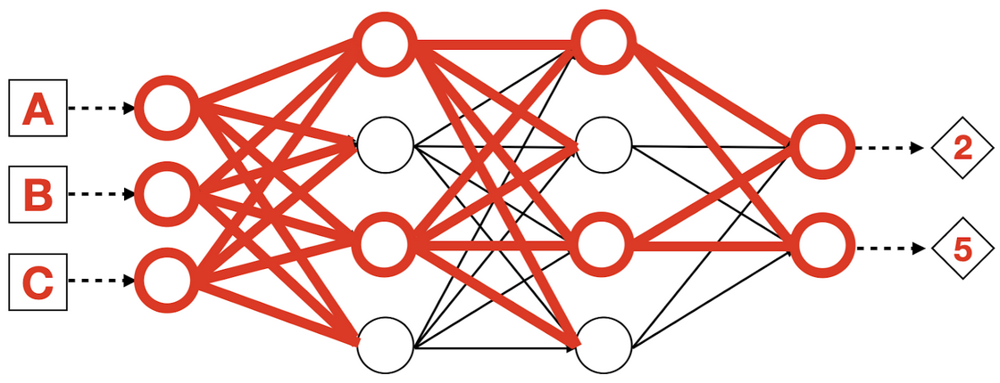
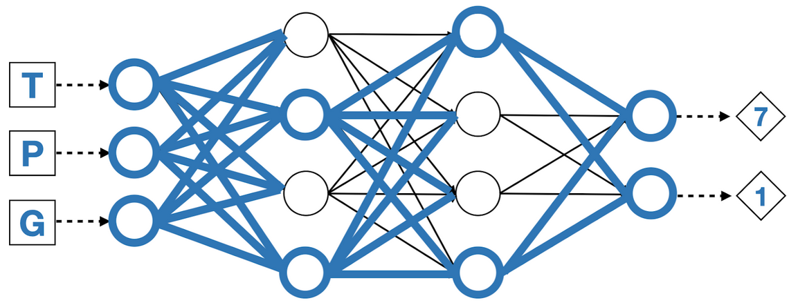

Please look at this picture for a moment:

How long did it take you to tell the rabbit from the cat?

I bet it was instantaneous: you just knew.

If you were to break down the steps your brain took, It would likely be something like:

* Both animals have black and white fur, two ears and four legs

But,

* The cat’s ears are shorter 
* The rabbit’s eyes are on the side.
* The cat’s tail is longer.

Your brain zipped through these steps - and many more - in a fraction of a second.

Now, could you write an *algorithm* that replicates the same process?
You might rightfully conclude that it would be practically impossible.

## The AI Revolution

DeepLearning Networks (or Neural Networks) are the answer. Their ability to “learn from experience” makes coding redundant,
and their incredible achievements in image recognition are what fueled the interest in AI over the past decade.

Say you have a stock of cute rabbit images. 

You can feed them to a specific kind of neural network built for the purpose. This network will scan all of them through
fine grained filters, that you can think of as a grid, like this one below but at pixel level.

The network will eventually select the combination of filters that is best able to detect the presence of a rabbit in 
any given image. In other words, the network learns the combination of features that make rabbits unique - their “rabbitness”!

## How Does The Network Learn?

The basic unit of a neural network is the Artificial Neuron, modeled directly on the neurons in the brains of humans and
animals. In practice, an artificial neuron is simply a mathematical function (named Transfer Function) with n weighted inputs.

The output value of the transfer function is passed on to the Activation Function, which is just a filter. Based on the 
output res, it will decide whether to propagate it as global output of the neuron, or filter it out and emit zero.

This is it. 

“It doesn’t look so powerful”, you might wonder. True enough: the immense power is only unlocked when very large amounts of neurons are combined. 

A typical neural network looks like the following image.

If we use A, B and C as inputs, some neurons will propagate the result of their transfer function to the next ones, and the final outputs will be 2 and 5.

If inputs change to T, P and G, the information will follow different paths to outputs 7 and 1. 

The different paths for different inputs stem from the weight configuration on each neuron. With thousands of them, combinations are practically infinite. 

So to answer our question: **the network “learns” the rabbitness of rabbits by tuning the weights on each single neuron until results are satisfactory.**

This process requires thousands of images and massive computational power, which was largely unavailable until recently.

## Next Steps

Inspired by neural networks? You can [learn more](http://shop.oreilly.com/product/0636920035343.do) and model your first 
AI around a domain you are passionate about, with the help of a DeepLearning library for the JVM!

[Deeplearning4j](https://deeplearning4j.konduit.ai/) is my favourite and the pseudo-code to build the network is quite readable:


final var network = 
  new NeuralNetConfiguration.Builder()
    .list()
    .setInputType(...) // CONFIGURE INPUT LAYER
    .layer(0, new MyLatyer.Builder()
       // CONFIGURE FIRST LAYER
       .build())
    .layer(1, new MySecondLayer.Builder()
       // CONFIGURE SECOND LAYER
       .build())
    .layer(2, new OutputLayer.Builder()
       // CONFIGURE OUTPUT LAYER
       .build())
    .build();


Beware: training a neural network and watching it improve over time will spark true emotions. After all, the process is 
*exactly* the same that babies go through while discovering the world.
