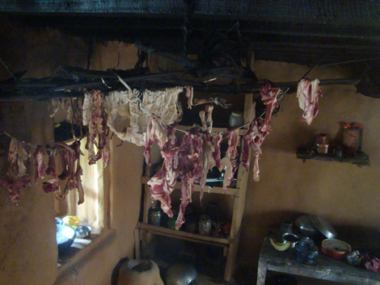
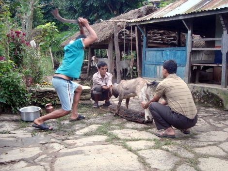
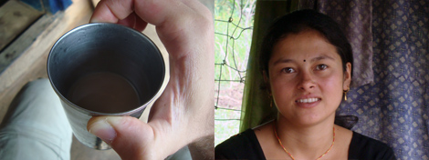
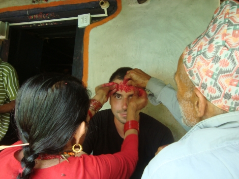
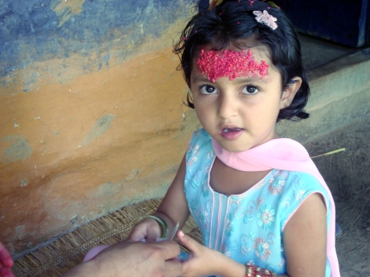
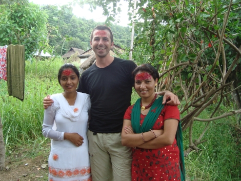
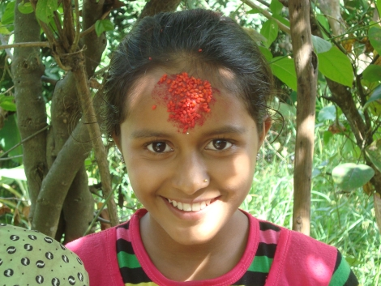

Do you remember the goat we sacrificed on the first day? Well, for the first time in my life I lived the joke about eating the same stuff forever. We never stopped eating goat and rice. Goat and rice, goat and rice. At the end of the third day, its smell began to anooy me, and the next day it almost nauseated me, probably because by the time we had started eating the part that had been driying up and had therefore stronger odor and taste. The meat had been up in the kitchen for all the time, with some minor heat always there - either a tiny fire or hot ashes.

I finally understood why flip-flops are so universally used: first, it's immediate to put them on and off, and seen how often they switch from "shoed" to barefoot that's the most convenient solution. Second, they're expendable: easy to wash and (in the worst case) cheap to replace.

In the morning, I attended another sacrifice, this time from the beginning. The strong picture below was taken half a second before the goat's head was chopped off in a dull thump. 

Back to the first day, I'm now happy that I didn't attend the sacrifice of the goad I would have been eating for the next four days. Because otherwise I wouldn't have been able to help Bhim chopping it afterwards. After witnessing the actual beheading, I was unable to speak for 15 minutes, until when a nice girl brought me a cup of milk tea with sugar and cinnamon which brought me back to the world.
That girl actually spoke English very well. Every morning she wakes up at 4:30 and walks one hour to go to school in another village. That's actually the reason she lives here: her original village is 6 hours walking away.

Today is actually the most important day of Dashain: the Tika day, when the elders of the village give their blessings. They strew colored seeds on people's foreheads while chanting some Nepali prayers. At the end they give a candy, which is what makes the blessed kids the most happy! I received the Tika as well. I felt extremely honoured.

Bhim's parents must be among the oldest in the village, so the procession of people and kids coming over to the house for the blessing didn't stop until late afternoon. It really felt like seeing the "circle of life" in action, I could imagine when today's blessers were kids and received the treatment from the elders of that time. They were children and now they are highly regarded.
In our society, the elders are more often seen as useless resource eaters. And maybe finally I was able to understand why: because when Bhim's parents were kids, life must have been very similar to what is today, and their experience really does matter. On our side of the world, where the technological progress is so fast and fuzzy, the knowledge that was so useful just a few decades ago is now maybe good for history books.

I need to add a final remark: the disposal of modern-day garbage. It's a huge problem there. All the little paths are littered with little plastic things, such as sigarette wraps. Everyone just throws away stuff, in the ground or in a rice field. And one particular episode gave me the key to understanding.
I had a few plastic things (a packet of paper tissues and such), so I asked where could I put it. The answer was astounding: in the compost pile. Shocking. I soon understood why though: they are so used to the fact that anything goes back to Mother Earth, that they treat plastic and similar modern crap in the exact same way.

It was a very, very difficult situation for me. I thought about our discussions with John, who faced the same thing in Sierra Leone. And I finally see what he meant when he said that you can't go to someone and just teach them how to do things. At the same time, I knew that their approach was fundamentally wrong. What to do?

I opted for a compromise. I didn't say anything like "you're doing it wrong", but I instead talked to Bhim about what I know about plastic degeneration over time, in a very simple way. I told them that in 1000 years that plastic will have broken down into tiny pieces, so small that they can't even be seen, end up in plants and animals and trigger cancer in both. This seemed to have some effect: Bhim proposed that maybe then it's better to burn it. I'm afraid it's not that easy, Bhim.

The next day, while walking, I casually mentioned the ban that China imposed on free plastic bags giveaway in shops, as those bags were cause of massive fish and sea birds deaths. Like this I gradually provided facts to him, rather than teachings, and then he and the others will draw their conclusion.
As a final thanks and support action for my ideas, I decided to clean the plastic litter from all around the households. Soon others and kids were helping me, and we filled two plastic bags. I showed them a pill container that had maybe been there for years, and still it was pretty intact. 

I don't know if this will have any following now that I'm not there anymore, the responsability for such education should be on the government. But we all know how reliable are the government of such countries, and Nepal in particular.

The following day it was time to go back to Kathmandu, but this is already another story. It was incredible to spend those four days there, I've seen so many things I would have probably never seen elsewhere in my life. And funnily enough, such a far environment helped me realise so many things about MY original society and setting. Will I be able to make use of what I've learned? That's always the big question.

