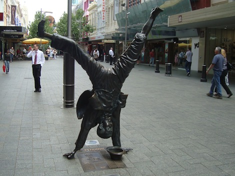
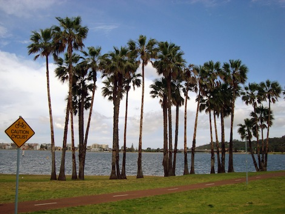
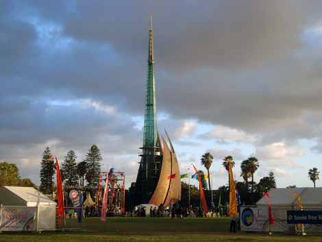
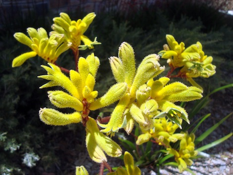
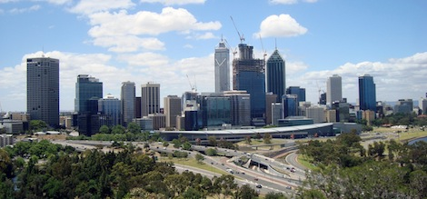
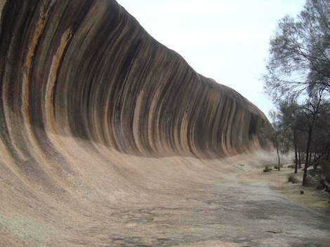
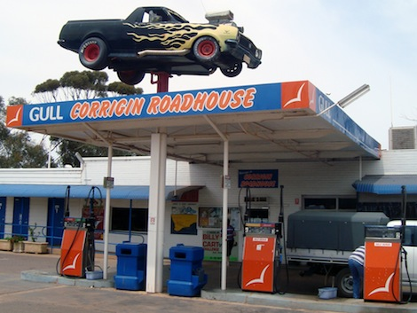
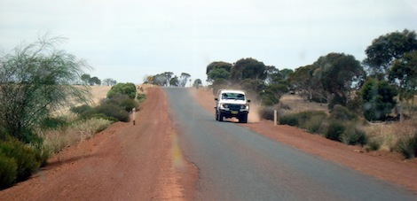

Yo mates!

One evening, in Sydney, I packed my stuff and took the train to the airport. Destination Perth, Western Australia - the other end of the continent, that is! Back in Europe, any flight takes some 2-hour-ish, I said to myself, ha!, this is going to be easy. What I didn't take into account was the hugeness of the country. It turned out that the flight would cross three time zones and take 5 hours to do so. Not only that: positive that we'd receive a meal on the plane, I hadn't eaten anything before, not remembering that I was flying with cheap-ass company Jet Star, which is the equivalent of the European Ryanair: food was sold at Apple Store prices. I chewed a mint gum for 5 hours.

...which also had another purpose, actually: during my last days in Sydney, maybe due to the bad weather, my right ear began to feel funky. I went to a doctor and he gave me some anti-sinus spray, and advised me to chew on the plane to avoid pain.

Once arrived in Perth, I met my friend Becky again! She was living in Amsterdam in 2007, when we shared many happy hours at Coco's, many hours with my band in a mouldy basement, many parties and one single dinner at a Thai resturant as I found that I don't like Thai cuisine.

I stayed a couple of nights at her place: she would work during the day, which I would use to go around the city. On the first day I followed a suggested walk in the center and, for the first time in Australia, I felt like I was walking in a relaxed town! The streets were quiet and little was going on. Here, check this funny statue in the middle of a shopping street!

Finally the weather was good with a lot of sun and just a touch of humidity, and I even had a fantastic nap on the grass in front of the Swan River!

Once Becs was finished with work we went to eat something at the Swan Festival Of Lights, next to the fascinating Swan Tower, a very modern and slim structure that contains very old, heavy church bells from the 14th century. I'm not sure I've ever seen a most random coupling, but ok.

The next day I walked up to Kings Park, or actually I ran to make it for the free walking tour. I hoped it would be more about the nature, instead I learned that it's the only park with more war memorials than trees, and we had to visit them all.

At least I was able to spot some interesting new plants on my own (this is becoming a tradition of Australian blog posts!) and a fantastic view on downtown Perth.

On my third day, Becky's holiday begun, and we spent the entire day on a wine tasting tour, organized by one of her friends for her friends (complicated sentence I know, but it does make sense). Some twenty people loaded on a mini-bus which took us around to three different wineries in the Swan Valley around Perth! It was really a jovial atmosphere and I was impressed to see the endless vineyards: maybe only the _Cantine di Tollo_, next to where I was born in Italy, would compare.

We managed to go to bed early, motivated by what is going to be the leitmotif of the next two weeks: an epic roadtrip! Becky has a 4WD van, Fez, which will take us all around in Western Australia! You are going to read heaps of adventures, guaranteed! The first leg of the journey took us to Esperance, in the South, and included a stop at the Wave Rock, which is something I have been wanting to see since Becky put some pictures of it on Facebook!

Very cool what water erosion can create - but I'm not sure all those flies were mentioned in the package I purchased. Becky was indeed worried that bugs and heat might be central in my posts, and I actually can see why, now: these fu**ing flies are there all the time as soon as you leave the cities, they come in swarms and fly around your face to the point that even standing still for a picture becomes a challenge!

One of the stops was at the gas station of a little town that holds the "Dog in a Ute" queue record. Basically, these guys are crazy about carrying dogs in their utes (from "utilitarian cars"), so in 1998 they put together 699 cars and 699 dogs and drove all together to the next town, 7 km away. Just when you believed that such things would only happen in the US!

We drove on highways, which sometimes narrow down to a single lane, involving some dusty driving if another car is coming across!

At the end of the first day we reached Esperance, on the southern coast. When I arrived I had no idea of Australian distances and spaces. Well, such a roadtrip is the ultimate way to gain a proper awareness of what it's all about. A car is the only way to travel around: you cruise through kilometers and kilometers of bushes and desert zones and some places are simply impossible to reach otherwise.

I always say that walking is the best way to "make the territory yours", kind of  becoming part of it. Cruising on a car is indeed different and the feeling you get is more of "estabilished dominance", nature has been modified to meet our needs. And seen the dimensions, here _this_ is the one and only way to be able to hear the breath of the land.