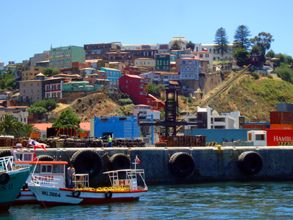
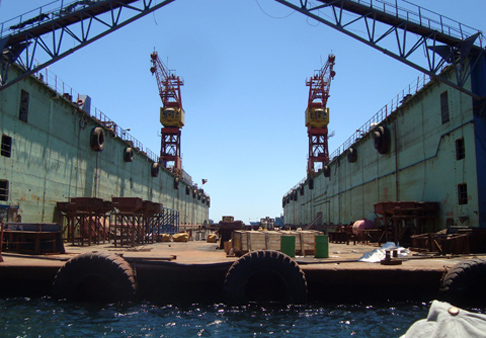
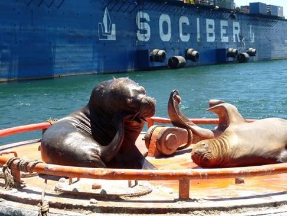
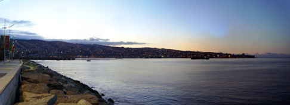

Hola compañeros,

How is it going? In Chile, summer is officially starting, being today the 21st of December. It's a nice sunny day outside. I actually keep seeing pictures of a very white Northern Europe and yes, every single image reminds me of why I left exactly in this period. Feel free to send me hate emails.

Life here in Valpo goes on without any particular disturbance - if we don't count the two minor earthquakes that occurred since I'm here! The first one scored 4.1 degrees on the Mercalli scale, the other one something less. The best of it all? I didn't notice either. My housemate is a kind of living seismograph instead, she would feel a half-degree earthquake in Buenos Aires.

One day we met another couchsurfer and we all went for a tour of the harbor on a little boat - you can see the kind of boat and one of Valparaiso's hills in this image:

On the right, you can also see one of the famous cable railway of the town - more about that in another post. The tour on the boat was quite interesting as we cruised next to a lot of ships that were in the harbor, last glimpse of a glorious past. We learned where the ships were built - almost all of them Europeans, there were even a few Dutch-made ones - and what their duties are. One of the most fascinating structures was a big "floating dock": another boat can enter from one end, then it's lifted and repaired.

Fortunately, the harbor is not only artificial stuff: the fishing industry seems to provide food for quite a few round, lazy sea lions. Here's a couple of them stretching in the sun. They make huge splashes when they jump back in the water!

Days are very long now - today is actually the Souther Emishpere's summer solstice! That let us do a lot of nice walks in the evening: around 7 pm the sun is still in full swing, but it's not as warm as around lunchtime. 

Such an evening walk is ideal to explore one of the many hills, each one with its own personality... and its own staircases.

This is where the deep beauty of Valparaiso lies. In anonymous corners and streets, in wrecked walls where black cracks become part of the colored graffiti. It feels like the colors are used to visually cover what is otherwise weakened by the time, hit by past earthquakes and never fixed because there is no money for it.

Another night walk along the coast took us to Viña, the town where we had the barbecue I described in the previous post. On the way back the sun was setting and the lights on the hills came to life. Too bad this picture is too small to give the idea, it really was a calm, fantastic view.

Oh, let me close with another colored but more personal matter. I'm completely done with the jet lag now, but the first ten days in the country left me with a lot of night hours to kill. This enabled me to reach peaks of the human intellect that I never touched before. Such as previously unknown levels of completeness of the Rubik's Cube! Nice eh, dad?

