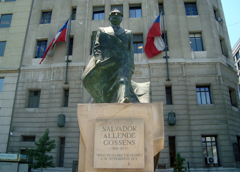

Immediately after the glorious Christmas days spent with Daniel and Luisa, another event was scheduled to take place: my lifelong friend Guido came all the way from Italy to Chile for a three-week visit! We went to meet him at the airport (thanks Paulina!) and he was ready for his first encounter with a Chilean institution: the _[Completo](http://www.uncorneredmarket.com/2011/01/valparaiso-chile-hot-dog-hunt/)_ sandwich. After that, we reached Daniel's apartment and cooked dinner for everybody. Cooking together when we meet is an important tradition that we try to honour whenever applicable. Earlier that afternoon I had bought all the ingredients for a _zucchini carbonara_ and Daniel made a Chilean salad so we were all set!
That night, Guido laughed off the jet lag and the next day we were ready to explore Santiago, which I had postponed all this time waiting for my friend!

The neighborhoods I had already seen were really nice, especially _Providencia_, where Daniel lives, but we found that there are a lot of cool spots and things to see in the center of Santiago.
What fascinated me the most is without doubt the Moneda Palace, especially for his historical background. This is where Allende barricaded himself and his family to the bitter end.

The building is actually straight, I just like it more like that. The big square in front of it is full of statues; the most important of all is obviously the one for Allende himself.

Santiago gets credits for hosting the most interesting and fun museum I have seen in recent times. The [Museum of Pre-Columbian Art](http://travelswith.zen-aida.com/2009/07/culture/santiago-museum-of-pre-columbian-art/) displays amazing statues. I know, it sounds like the usual boring stuff they forced you to learn when you were at school, but this is not the case: the statues here are very funny and interesting look at! For instance, this statue is captioned as "young wife" and I believe it unveils the origins of the mythical Italian gesture! Look at her hands and facial expressions: she's totally saying to her husband _"ma che cazzo stai a di'!!"_

Wonderful statues! Those that you see here below, put in a shady corner, were really absorbing, for sure one of the best pieces of the entire collection.

Alright (with one "L", Susina!), let me now describe a couple of downsides of the city and we'll finish on a merrier note. The next picTURE (and not only "pic", John!) is taken on top of a cute hill in the heart of town, _[Cerro Santa Lucia](http://en.wikipedia.org/wiki/Santa_Luc%C3%ADa_Hill)_. 

Despite it being completely against the sun, I chose it for two reasons. First, we're very hot. Second, it shows two main features of Santiago: the squared, horrible buildings that demolish any cool view from above and the foggy background. That is not the poetic, hydro-oxygenated morning fog but rather smog. The traffic is really bad as Santiago and its surroundings form an overpopulated area where almost 7 millions human beings live. Which is almost half of the entire Chilean population!

We had lunch with Paulina along one of the beautiful treelined pedestrian _paseos_ of central Santiago. She's a true _santiagina and took us to her favourite busy _sandwicheria_ and café. Having spent a few years studying in Italy, she was more than happy to practice her language skills. Never mind the Roman bias that Guido and I put in our Italian, that is an actual plus!
It was then already time to go home and pack for Valparaiso. Plaza de Armas, another important square in the heart of the city, delighted us with some kids playing in the fountain. We also got some water thrown at in the end, but considering the heat of the sun we couldn't complain at all!

