| When | Project | Short Story | Tech | Screenshot |
| :--- | :---- | :----- | :--: | :---- |
| 2018 | [Ace&nbsp;&&nbsp;Tate]( "Ace & Tate") | Modernizing the eCommerce engine of a scale-up eyewear retailer 🕶 | Scala, Akka, Lagom, GCP, K8S | [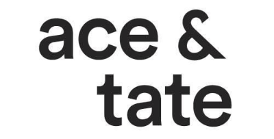]( "Ace & Tate") |
| 2018 | [Caterina]( "Caterina") | A "Streaming Big Data" project to find reliable patterns between the price fluctuations of a cryptocurrency and events related to it. 📈 | Scala, Akka, Docker, GCP, K8S | [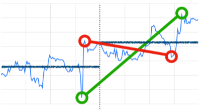]( "Caterina") |
| 2016&nbsp;to&nbsp;2018 | [Weeronline]( "Weeronline") | Weeronline is the top player in the weather forecast business in the Netherlands. I covered different roles there, from software engineer to Tech Lead managing the entire development department. ☀️🌧️☁️ | Scala, Akka, Java | [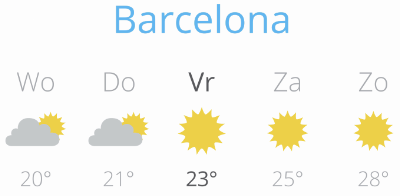]( "Weeronline") |
| 2016 | [The Things Network]( "The Things Network") | The Things Network is a crowd-sourced LoraWAN network that covers the entire world, more or less. I built an [Android SDK](https://github.com/ticofab/The-Things-Network-Android-SDK) to interact with its original (long discontinued) MQTT API. 📡 | Android Java | [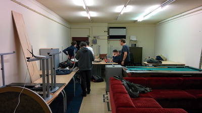]( "SpeedyNappy") |
| 2016 | [SpeedyNappy]( "SpeedyNappy") | SpeedyNappy is an app that lets you find the closest venue with a changing table for your baby. User-source data, reviews and all! 🚼 | Scala, Play, Java | [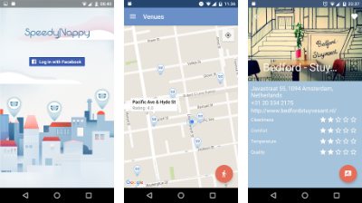]( "SpeedyNappy") |
| 2015&nbsp;to&nbsp;2016 | [Perfect Earth Animals]( "Perfect Earth Animals") | Perfect Earth Animals was an app in the [Perfect Earth](http://perfect.earth) world - an ecosystem focused on ecology and sustainability. I built the Scala / Play backend and the Android client, which embedded my other project CloudMatch! 🐬🦜🐆🐞 | Scala, Play, Java | [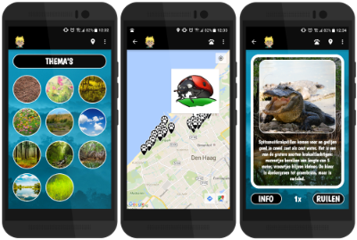]( "Perfect Earth Animals") |
| 2014&nbsp;to&nbsp;2015 | [Horsha]( "Horsha") | Horsha was a startup in stealth-mode building a social network for horse owners to help them share the care for their animals. I built the native Android app. 🐴 | Java | [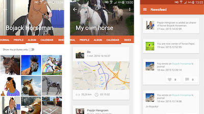]( "Horsha") |
| 2013&nbsp;to&nbsp;2014 | [CloudMatch]( "CloudMatch") | CloudMatch was a cloud engine that allowed people to use gestures across multiple touchscreen devices. Heavily distributed, it marked my entry in the Scala and Akka ecosystem. 📱📱 | Scala, Akka, Java, Objective-C, MongoDB, Docker, Kubernetes | [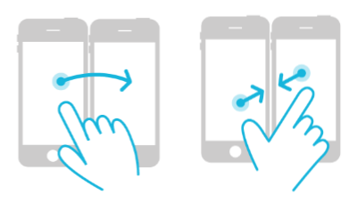]( "CloudMatch") |
| 2012&nbsp;to&nbsp;2013 | [Snipper]( "Snipper") | Android developer for a startup in the consumer video space -- think Instagram for movies. Occasional work on the Java backend and on a coupled web product. 📽 | Java | [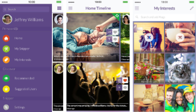]( "Snipper") |
| 2007&nbsp;to&nbsp;2012 | [TomTom]( "TomTom") | My first corporate experience in Software Development. I have the fondest memories of it. A fun product in a fun, young environment. 🌎 | C++, Java | [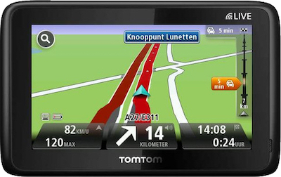]( "TomTom") |
| 2003&nbsp;to&nbsp;2007 | [Academic&nbsp;Research]( "Academic Research") | My academic research and Master's Thesis on Scale-Free Networks and the Internet topology. This worked allowed me to publish five articles and win a grant at the University of Amsterdam under the HPC Europa program. 🎓 | C++ | [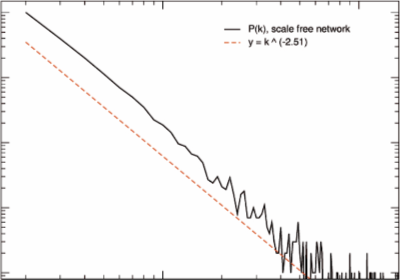]( "Academic Research") |
| 2001&nbsp;to&nbsp;2006 | [Litfiba&nbsp;Official&nbsp;Website]( "Litfiba Official Website") | The rock band from the below website offered me the position of Webmaster of their official website! 🤘 I built a Flash website that still looks gorgeous - at least to me. 🎤 | Flash, Actionscript | [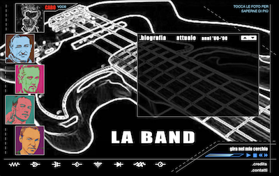]( "Litfiba Official Website") | 
| 1998&nbsp;to&nbsp;2001 | [Litfinternet]( "Litfinternet") | My first website, pure HTML written entirely by hand with Notepad on an old Amstrad 286. I was still in high school and in love with the greatest Italian rock band of all times. 🎸 | Hand-written HTML on Windows95's Notepad | [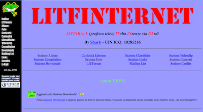]( "Litfinternet") |

