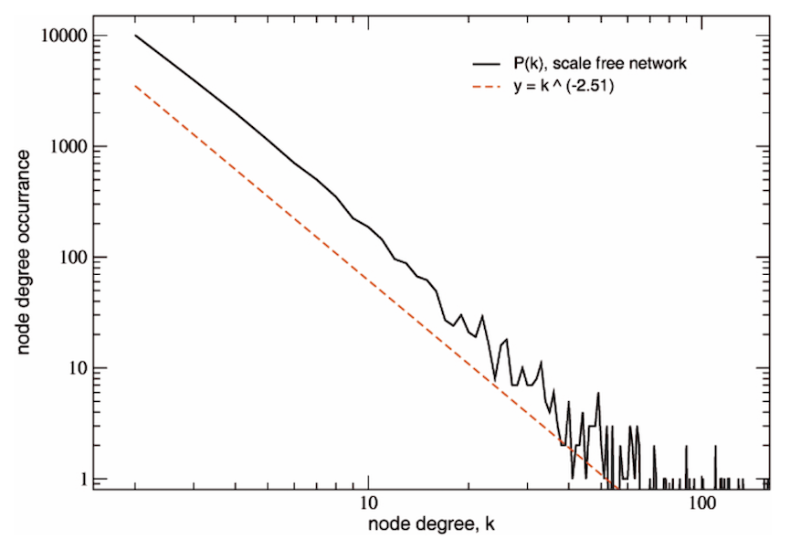
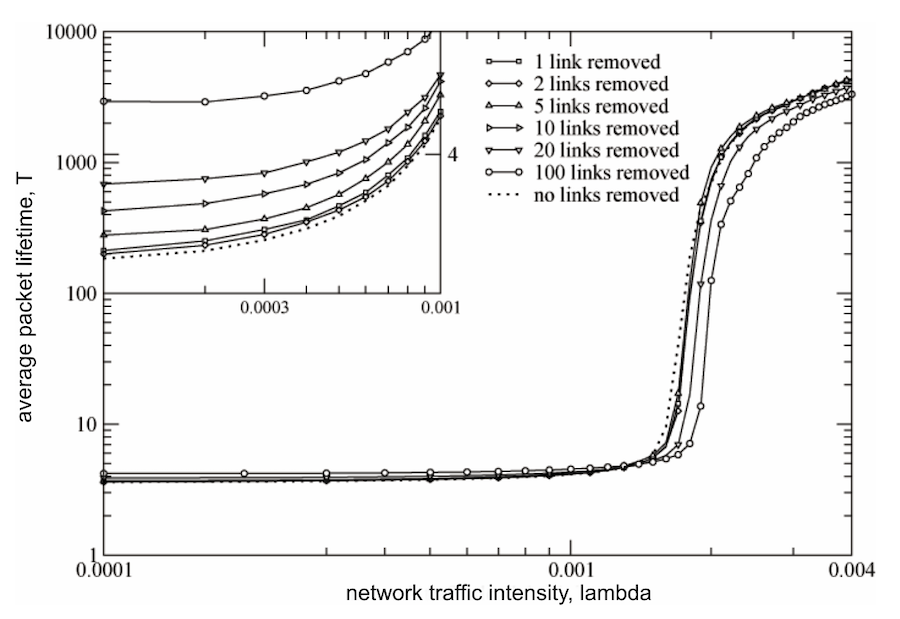

My time in college, studying Telecommunication Engineerin at the University of Rome "Tor Vergata", resulted in some interesting research
in the networking field. I was especially interested in topology matters. The actual shape of the Internet - what does it look like?
What kind of properties does a network grown without supervision have? What are its pitfalls? Can we do anything to improve it?

This is a list of the scientific publications that I authored.

| Year | Publication | Journal |
| :--- | :---- | :----- |
| 2008 | [Is the topology of the Internet network really fit to its function?](Is_the_topology_of_the_Internet_network.pdf) | Physica A 387 (2008) 1689-1704 |
| 2008 | Simulation of Data Traffic Dynamics on Large Complex Networks |  Hpc-Europa Report |
| 2008 | [Modelling interdependent infrastructures using interacting dynamical models](modelling-interdependent-infrastructures-using-interacting-dynamical-models.pdf) |  Int. J. Critical Infrastructures |
| 2007 | [Topological properties of high-voltage electrical transmission networks](topological-properties-of-high-voltage-electrical-transmission-networks.pdf) | Electric Power Systems Res., 77 (2007) 99-105 |
| 2006 | [Telecommunication Engineering, Master's Degree Final Dissertation](fabio-tiriticco-masters-degree-dissertation.pdf) | Printed in 3 copies |
| 2004 | [Growth mechanisms of the AS-level Internet network](growth-mechanisms-of-the-as-level-Internet-network.pdf) | Europhys. Lett. 66 (2004) 471 |

---

The starting point of the research was a body of work that Barabasi, Strogatz en al. had been working on since the late 90s. Their findings showed that
organically grown networks display a degree distribution, where the degree *k* of a node is the amount of connections between that node and other nodes,
which follows a decreasing power law: *k^-a*.

In practice, there will be a few nodes with a very big degree (*hubs*) and a vast amount of nodes with a very small degree (*leaves*). 
Plotted with a logarithmic scale, the distribution looks then approximately linear.

Such networks, defined "scale-free" are found in different fields -- biology, sociology, tech and much more. For instance,

* The interactions between proteins in a cell metabolism
* The contagion network of sexual diseases
* The autonomous system level of internet gateways

When taking into account the flow of information through the network, Scale-Free networks display clear advantages over 
networks with different distributions. Notably, 

* The average distance between any two nodes tends to be shorter as most shortest-paths will travel through the hub nodes.
* The degradation of the network's performance following the removal of random nodes is greatly increased as most nodes are poorly connected.

At the same time, such networks are very vulnerable to targeted attacks: the removal of a hub is most likely going to bring the
entire network down and compromise its functioning - both globally or locally. One such example was clearly observable after the 11th of 
September 2001 destruction of the Twin Towers in New York: below them, a key node of the optical connection between Europe and
the US was destroyed too. As a result, packets crossing the Atlantic Ocean had to find new, longer routes. Which in turn became
congested.

---

This was the main context of my research. On the technical side, I used C++ to build a simulator that could build a network,
let traffic flow through it (with different routing strategies) and analyze the network performance and behaviours.

I just looked at the code for the first time in about 14 years, and it was obviously shocking and embarrassing. 
Were I to do this research again, oh boy, it would look so different.