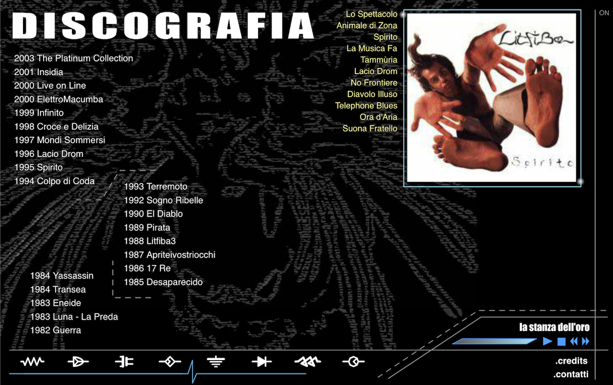

The greatest Italian rock band of all times offered me the position of Webmaster for their official website back in 2001.
This happened as I had created a [fan-page]( "Litfinternet") about the band a few years earlier.
I enthusiastically took the role and initially maintained their existing website, until the point where a new one was due.

I took care of both design and development; for the latter I chose Macromedia Flash and coded everything in ActionScript 1.0. 
The result was something that looked incredible, had smooth animations everywhere and loaded very fast.



In fact the animation were such a core part of it that I decided to record a screencast to show what it looked like. 
To me, the website looks awesome to these days and fully passed the test of time! 



---

The website design was heavily inspired by my Telecommunication Engineering studies at the time. Electric symbols or circuitry are a recurring element.

Usability was the main issue. The website didn't look like anything else around at the time and therefore it was difficult to navigate at first look.
From a business perspective, it was also quite a niche technology, while most websites were HTML tables with some JS sprinkled on top and powered by PHP backends.

I still have the `.swf` compiled files, but the source `.fla` files are no longer supported by Adobe I couldn't find a way to change them again.

I worked there for a total of five years, which mostly overlapped my college studies. During the first year, 2001, I had a contract with EMI Music.

