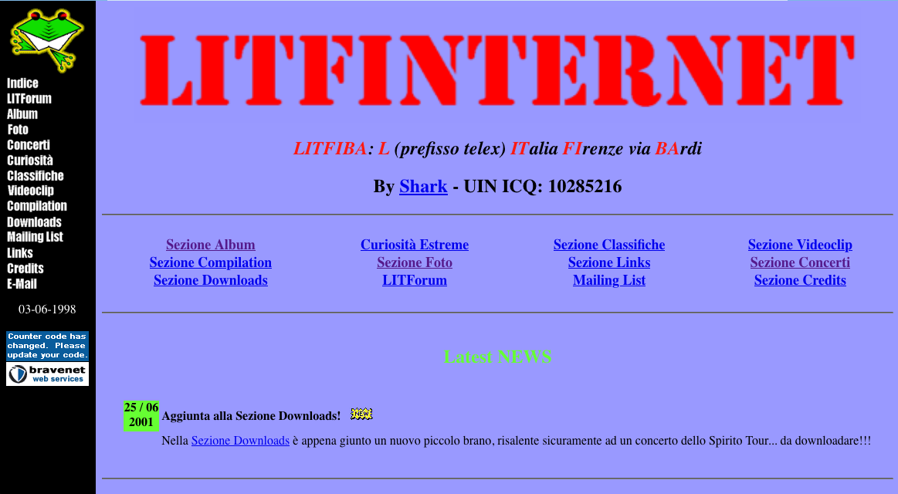
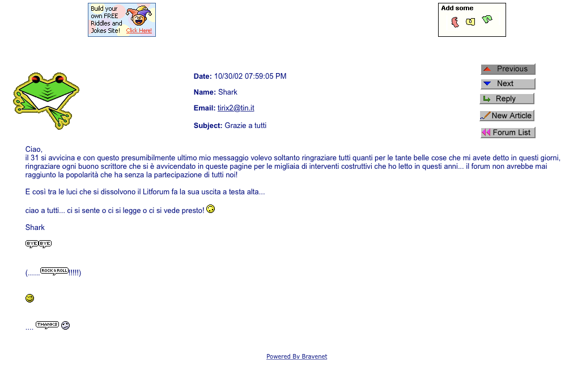

My first website *ever*. 

* [Source code on GitHub](https://github.com/ticofab/litfinternet)
* [Still alive Website](http://web.tiscali.it/tifabi/)  

Back in 1998 I was 16 and the World Wide Web was a new thing. 
I was also in love with the greatest Italian rock band of all times, named Litfiba.
My nickname was Shark.

I decided to create a website about the band. The site would be called "Litfinternet", from Litfiba + Internet.
I learned HTML from some weekly guides sold with the Italian newspaper "La Repubblica". 
I remember writing it all by hand in Windows 95's Notepad. No CSS, no Javascript, no PHP. Only HTML.

This is what the resulting HTML looked like. No indentation, all caps.


<HTML>
<HEAD><TITLE>Litfiba</TITLE></HEAD>
<BODY bgcolor=#553E37 link=#FF8040 vlink=#FFFF00>

<H2>Litfiba (1982)</H2>
<UL>
<LI>Guerra
<LI>Luna
<LI>Under the Moon
<LI>Man In Suicide
</UL>

<STRONG>Mini Recensione:</STRONG> Bè ragazzi, qui si chiede davvero troppo, anche per un serio appassionato come me, ma che purtroppo non può considerarsi un collezionista vero e proprio. Quest'album è introvabile nei normali ritrovi della musica (ergo negozi di musica), e penso che l'unico posto dove sia reperibile siano i "mercati dei collezionisti", dove la gente scambia, vende e compra musica "antica" per collezionismo. Da quel che ne so il prezzo è superiore al milione, e credo che in giro ce ne siano pochissime copie, considerando che a quel tempo gli unici fan della band saranno stati (forse) i genitori di Piero e Ghigo. Guerra e Luna sono stati riproposti, rispettivamente in Desaparecido e Litfiba Live, ma non so quanto possano questi essere diversi, non ne ho veramente la più pallida idea. Potrei ipotizzare che, considerando che nei primi anni '80 i rimaneggiamenti live non erano come quelli di adesso, Luna di quest'album non sia tanto diversa da quella in Litfiba Live, se a questa si esclude il parlato con l'eco di Piero (...sarò re e dittatore...vi schiaccerò come delle merde...la massa è una merda etc etc.(che bei tempi!)). Comunque, pregherei i visitatori di questo sito in possesso di tale album di scrivermi un'<A HREF="mailto:tirix@tin.it">email cliccando qui</A>, dandomi la risposta ai quesiti lasciati in sospeso in questa mini recensione, e dicendomi anche di che parlano le ultime tre canzoni... VI PREGO!

<A HREF="album.htm">Ritorno all'indice</A>



Beside coding, I was also designer and illustrator for this website. Back then it was called 'WebMaster'. 
The 90's naivety and tackiness are in full swing.

An Italian ISP named Tiscali was my host of choice: to their absolute credit, the website is still [up and running](http://web.tiscali.it/tifabi/) and is still fully functional,
with the notable exception of a few dynamic services powered by Bravenet, such as a visitor counter and a PHP forum added much later.

The forum became the most important online platform for fans of the band, especially in crucial times when the band split. A lot of work went into moderating the forum,
and despite the earlier trolls (unforgettable people such as Asterix, or a certain Robbie that was an absolute toxic presence), good relationships were forged and it was a lot of fun.
Here's one final message I posted when I shut it down later down the road.

So many memories.

