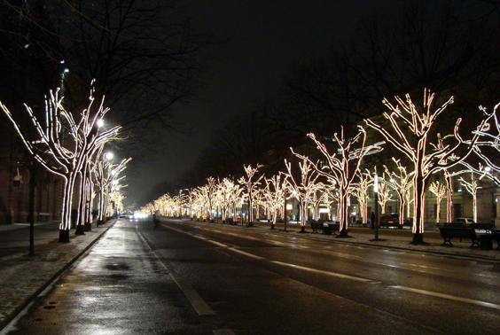

I was overwhelmed by Berlin. This city is the living testimony of the ultimate atrocities that took place on European soil in the 20th century. Around Christmas time, the trees of the inner-city artery _Unter Den Linden_, which leads to the Branderburger Gate, are decorated with lights. Yet they failed to convince me that Christmas does happen here as well. 

