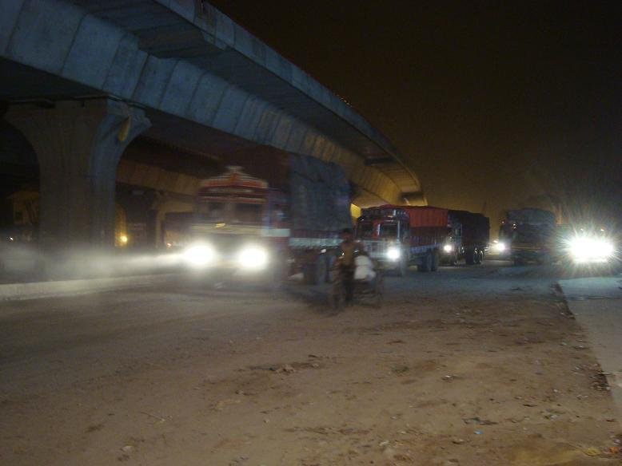

Hey hey!

Here's the first message from my six months off work! I'm writing from Agra, a few hours away from New Delhi, in India!

On the 16th of September night we had a big dinner at Carlos', where I've been staying lately. As I was about to leave, the theme was "Dutch". Not being the Dutch cuisine especially rich, the menu was easy to plan: zuurkool stampot (mashed potatoes with sour cabbabe), apple pie and the Albert Heijn Party Mix, which comes with a load of Bitterballen, Felafel, chicken nuggets and alikes. The most horrible party snacks you could ever imagine, yet the Dutchiest item of the dinner. That night I didn't sleep well, probably because of my pre-leaving emotional state! Or maybe because of the Party Mix, we'll never know. I took a picture of my last night in a familiar place. Oh, power has just gone away for a minute and come back.

The next morning I met Greg and his brother Peter at Centraal Station. Train to the airport and the flat land was soon a nostalgic memory. The journey was long and included a 2-hour connection in Moscow. Upon arriving in New Delhi, an unfortunate event revealed my why you shouldn't travel on a Friday 17th (the Italian unlucky day) and not with the Russian company Aeroflot: my precious Ferrino bag didn't appear on the rolls! As I write I haven't received it yet, but chances are that I might be able to pick it up tomorrow morning, when I'll be at the airport again to leave for Kathmandu. It's a pretty fucked up event to happen at the very beginning of this trip. I think I'm dealing with it pretty well, but it makes me anxious every once in a while and this bug doesn't leave the back of my mind. Please keep your worldwide fingers crossed for me!

In Delhi we met another brother of Greg (so we're four now) and our Indian friend, Taron, who had organized a private driver who took us directly to Agra. Considering the plane delay, the paperwork I had to do for the mishandled baggage and the waiting for the driver, we only left the airport at about 3:30 am. The night car journey was like diving immediately into India.

Despite it being 4 in the morning, the streets were more alive than an ant nest. Roadworks and building sites are EVERYWHERE, visible symptom of a growing economy, and this makes everything dusty. Really, dust is everywhere.

All kinds of vehicle meet on the road: bycicles, horse chariots, motorbikes, cars, vans and huge trucks, and all have one thing in common: they HONK. Loudly and frequently. Honking seems to be what defines the traffic rules here: when you approach another vehicle, you honk. This way, the other one realizes that you're there too, so the game changes. It's incredible, an incessant noise that fills your head at any time of the day.
The famous holy cows are also on the road with you. They literally lay where they please, even in the middle of the way, yet nobody seems to honk at them. People can but avoid cows, which make things even more complicated. Traffic here is primal chaos.

We had several pit-stops during the journey, at one I met these two Indians who asked me to take a picture of them and send it via email. 

We checked-in at the hotel around 10, slept some three hours and got up to go to see the Taj-Mahal, one of the Seven Wonders of the World! Definitely remarkable, but in all honesty it didn't impress me. In the attached picture I'm sitting on the "Bill Clinton" bench. Spots are named after calebrities who posed on them for pictures. Other benches are devoted to Lady Diana or Osama Bin Laden (!!).

It was since the Central America trip in 2006 that I didn't find myself in a country where the poor are so many, and I honestly forgot how it was. Dirt is everywhere, there's a lot of new stuff being built but there's even more stuff which is abandoned or poorly maintained. And the swarms of begging kids, that I had also forgotten. It's quite a strong sight, yet everybody recommends to ignore them. Being here makes me often think about "Slumdog Millionaire", only fortunately nobody stole our shoes at the Taj-Mahal!

ciaoo
fab
