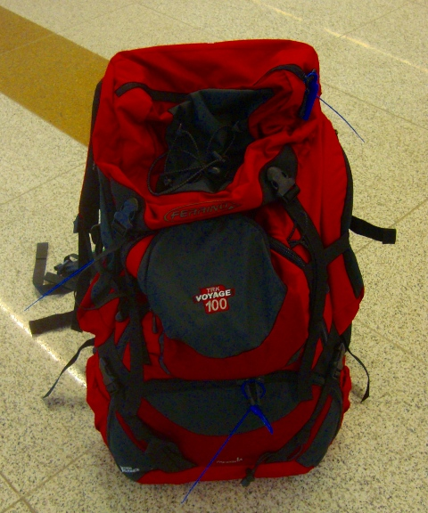
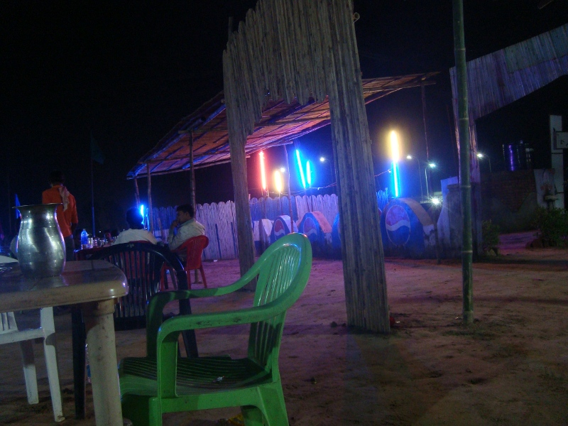
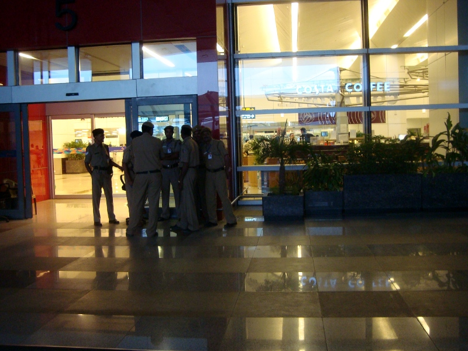
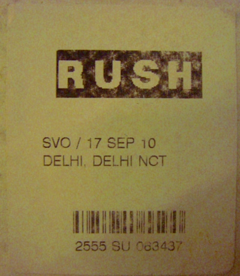

Hi all,

Fantastic news: I got my backpack Ferrino back!!

Last night, immediately after the update, we enjoyed one more little hour chilling out and then it was time to leave Agra to come back to Delhi. We left around midnight, and the journey in the dark was definitely more enjoyable this time, the only downside is that for the second night in a row I had almost no sleep, but that's ok. We even stopped for a delicious Chai (an Indian beverage, similar to tea) at a random stand on the way.

Let's now switch to the present tense to make you feel more part of the action.
We arrive at the airport around 4:30. We actually wait for two more friends who are going to join the trekking party, and at about 7 I walk to the Aeroflot office, a door in a labyrint of corridors. I had the number that I had called yesterday, the agreement was that I should call back today after 8. I dial around 7:10, and someone is there. "Call back TOMORROW MORNING, today is Sunday and the office is closed", is his first reaction. "No, wait, lissa: I will fly to Kathmandu in 3 hours, I need the bag now!" -- "Uh, ok, wait in line", and he disappears.
After 8 minutes of waiting I hung up. I dial again and it's busy. I dial a few more times till the phone begins to consistently prompt "Network Error". Temporary panic. I look at the receipt of the mishandled baggage declaration: there is another number. I dial that one. The same guy as before picks up. "Hey, it's me Fabio again!" -- "Call this other number, the lady will tell you what to do", he says, and I frantically note the cyphers down. But oh, I realize after the conversetion, it's an Indian number, I'm not sure how to dial it, what's the prefix etc. 
A door opens on that corridor, it's an angel disguised as cleaning boy. He helps me out and passes me on to another angel, this time disguised as a secretary of another fly company. We call together and somebody does reply at the other end: it's indeed a lady, who after asking my name instructs me: "Come to Terminal 3, Arrival gate 6, I will be there and give you the bag". Joy! I rush to Terminal 3, find the 6th gate, but another, terrible obstacle stands in the way. The military guards. 
If you thought that Fort Knox was a well guarded place, come check out the Delhi International Airport. Every entrance is patrolled by armed soldiers, very reluctant to listening and not keen to sympathize. Take into account the Indian Employee Moltiplication FX that I mentioned in my previous post, and you'll have this situation: 

After the run, I'm standing outside the Arrival Gate 6, passport and baggage claim in the hands of an old imperial defensor. No way I can get in. I try to call the lady again, but it doesn't work. I'm losing precious time and I'm seeing the meeting fading away. The guard sends me to Gate 5. As I walk I give peeks through the glass to see if any lady is holding my bag.. I spend some more time with the gate 5 guard, who in the end tells me to go to the Departure Lounge. "But I have an appointment here", I begin to explain, when all of a sudden... Gate 6 opens, and a girl in hostess uniform, comes out surrounded by a glorious light pushing a trolley which carries the shiny Ferrino! "I realized that there are too much formalities to let you inside, so I thought I'd come out", she explains. Imagine yourself my feelings at that moment!

I check the content of the backpack and nothing is missing! During the operation I notice a few extra stickers on it, probably added in Moscow once they realized the mistake. In particular, this one appears on almost each side of the backpack:

