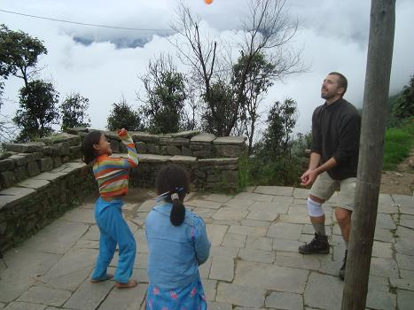
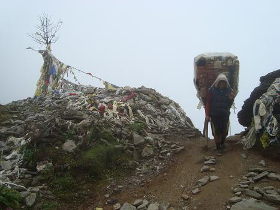

Hey all,

I'm back in one piece from the 17-days trek in Nepal! We've crossed incredible landscapes, seen breathtaking sceneries and ate delicious food. It's clearly an impossible task to describe everything properly, I'll try to do a quick day-by-day journal. 
The title is a reference to a previous story I wrote, in that case it was "His Majesty" and I was talking about the Mt. Fuji in Japan. This time around, our ultimate goal was the highest mountain on the planet, the emperor Mt. Everest.

**DAY 0 bus from Kathmandu to Jiri**

The adventure starts with a bus journey from Nepal's capital city to Jiri,
the village where our trek will start. It's a ten hours bumpy bus ride on an
unpaved road, with any kind of people and animals on the bus, including a
goat and an unconscious person carried like a backpack. There is a lot of
physical contact with everybody else, at some point the kid next to me
simply fell asleep on my shoulder.
From the window, we see a lot of kids walking along the road, going from one
village to another, probably to school since they all wear a blue uniform.
At some point we decide to travel for a bit on the roof, which is actually a
lot better as we get a lot of cool views... until it starts to rain. We
don't want to get down so we shelter ourselves with some plastic sheet we
found there.

**DAY 1 First steps**

It starts hard with lots of ups and downs, but also lots of breaks we take it really easy, we rest every 10 minutes. We don't push like we would do with Carlos, I guess it's because our guide Gopal knows it's best for the first day to avoid too much stress on legs and knees, also because the trail gives us immediately a lot of ups and downs! We go through houses and terraced fields, and what I immediately feel is that what for us is a holiday trail, for them is a normal road. Kids go to school everyday on that trail, any good is transported on it, that's where trade occur. Amazingly, for these people it's so normal that even when the terrain is rocky, slippery or muddy, they walk in flip-flops! All the people we meet are used to a life in mud and dirt, and are very loose about their clothes or themselves getting dirty. The Western concept of perpetual cleanliness doesn't exist here. Kids are happy to be taken on pictures, they want to see it after and laugh very hard!

During the breaks I start playing the armonica that David gave me, I don't think about notes or tones but I rather try to get something nice out of it. At dusk we arrive at our lodge, light is provided by candles and we play Black Queen with some nepalis, the forfait is a red chili and a local guy sings a mantra because he doesn't want to have to eat it!

**DAY 2 LEECHES**

We don't walk long today as the day is cursed from the beginning by a heavy rain. The main event though is the encounter with many leeches!! Horrible, horrible creatures. They stick to your skin and suck blood till they're full and fall off. And the worst thing is not even the blood sucking, but the fact that they inject you an anti-coagulant, so that the wound will keep bleeding for up to two hours after the parasite left! At night we're all bloody and our clothes have big red spots.
We stop at a little village that boasts a little buddhist monastery. Only three young monks live there and they open it for us to visit, showing us their own work. Then early to bed as we plan to get up at 410 the next day.
Tragic event of the day somehow the heavy rain made it into one of the pockets of my jacket and reached my camera, which fills up with water. The guy at the lodge where we're staying has a screwdriver, I open the camera up and try to get the water out of it, but it doesn't feel good so I'm quite desperate about it!

**DAY 3 THE BREAKTHROUGH**

We wake up at 410 to compensate the previous day! Lots of stuff happens today we kick ass in the morning, getting to the top of a very steep climb. Peter, Greg and I get there first and we stop at a teahouse, where I get to play some sort of volleyball with the kids and help one of them with her English homework. Any kids speaks the language better than any adult. At some point the lady offers us an enormous brick of hash and another one of weed!

While yesterday it was an old woman who set the pace on the hill, today it's a cow. Leeches have become normal, but at night I have an unpleasant surprise. A thick leech falls off my body, can't say where from. A quick inspection reveals that it was on my thigh, VERY close to the intimate parts! Blood pours out of the little wound. I patch it with plasters and paper tissues, but one and a half hour later it hasn't stopped yet! I kinda panic and go to the kitchen where all the locals are. I have the honour to be given two traditional treatments my wound is rubbed with some special leaves, but it doesn't seem to work, so the owner of the lodge decides to use the heavy weapons. He comes back warming up in his hands a black stuff with the consistency of oil, which looks like the X-Files's Black Cancer, that he subsequently spreads on my thigh. I put a new big plaster on the spot and after a while the bleeding stops. From this point on we check each other very often for leeches!
From today on, we walk together with a lot of porters. These little nepalis carry SO MUCH STUFF it's unbeliavable, and are perfectly organized against the rain!

**DAY 4 ALTITUDE SICKNESS**

In the morning, I wear the wet stuff from the night before (I'd washed it as it was too bloody) and start walking very cold in the first ten minutes, after half an hour everything is dry. We take less breaks now, and today is the first day that we actually walk any scheduled kilometer! Unfortunately the sun is still very shy and the beautiful landscapes are often covered by clouds. We cross a pass at 3.500 meters, where it's quite cold.

During the descent, I start to feel a light headache. By the time we reach our lodge few hours later, it has become a lot stronger and more painful, and it's been joined by loss of appetite and strong nausea. It's definitely altitude sickness and I feel like crap. We have probably climbed too fast and I haven't drunk enough water. Joel gives me Diamox, an ad-hoc medicament, and I go to sleep while the others are busy playing cards. We are now 2.800 meters high, 700 meters lower than the pass, and the next morning I feel very good. That means that my acclimatisation line is somewhere above three thousands meters, which will be a very useful knowledge some days later, when we'll be approaching the highest mountains of all...