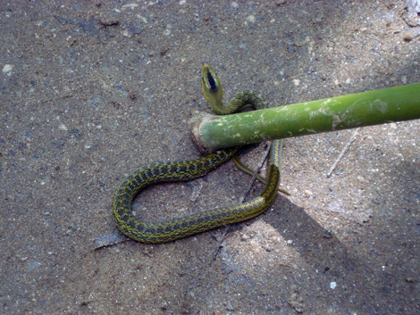
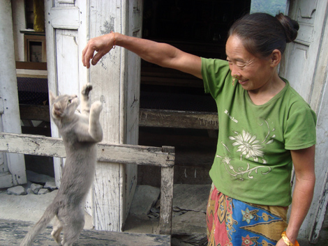
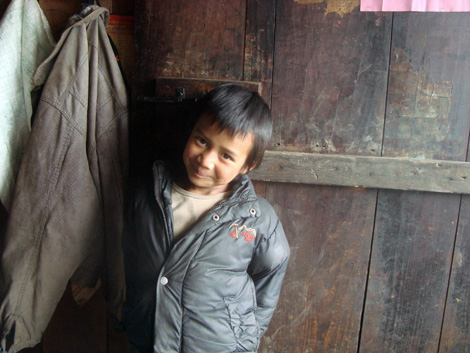
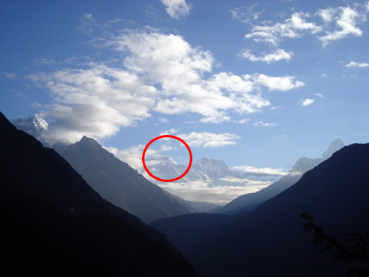

**DAY 5: DONKEYS**

Today's walk starts easy: the altitude sickness is gone and for the whole morning we walk on the ridge of a mountain, which is flattish and offers amazing views. In the afternoon we climb a bit steeper till we reach another peak, about 3.000 meters high, where we have the best Dal Bath so far. The "Dal Bath" is probably the most typical dish in Nepal and it's what we've been eating the most throughout the trek. It's basically rice with some vegetables and a lentils soup to top it all. A great feature of this dish is that the cook will come by for a free refill once your plate is empty. After lunch we descend, the pace is today set by donkeys (sic). 

Today is the first day I walk without the knee support, and at the end the right knee hurts a bit. Also, two members of our crew (we're 6 in total) are using a porter to carry their bags. The porter is Robin, and despite the incredible weight he carries he's a "fast motherfucker" :-) I could barely lift his load and could have maybe walked on a straight line with it but it felt absolutely impossible to do anything more than that.

Life here up in the mountains seems to have stopped in time, or maybe it's just a lot slower than in the western world. There's no sign of modern technology, except for some battery powered radios that are almost in every little hut we pass by.

**DAY 6: WILDLIFE**

Today there's a lot more wildlife on the trail, from huge butterflies to noisy insects, and at some point we crossed ways with a green snake which is supposedly incredibly dangerous, I think it was a pit viper. Gopal (our guide) lets us give a peek and then throws it away with the stick.

As we walk we say and receive a lot of "Namaste", the Nepalese hallo which literally means "I see God in you". We cross a suspended bridge of 105 meters over what is called the "Milk River". Also, it's another day walking with the donkeys. At a little village I stop one moment to check a blister, when the donkeys arrive from behind: it feels like the scene of The Lion King when Mufasa dies! :)

**DAY 7: ARMONIC RUN**

As I wake up, my left foot's toes are all covered in coagulated blood. A leech has probably got there while I was washing myself at the fountain the night before. While I wait for the others in the morning, I get all excited about playing the armonica and I even manage to pull out "Auld Lane Syng"! It's an easy walk today, we get to destination in time and with a wonderful weather.
For the first time after a week of walking I think I notice that my body is growing more powerful. At lunchtime, Greg and I run ahead to order food before the other arrives: it's a crazy 20 minutes fast run on a descent next to sheer drops, potentially deadly but definitely a lot of fun :-) It really felt like using my legs at their fullest, and still they don't hurt!

**DAY 8: GLOBALISATION**

Today it's the day we are going to meet Guillame, another friend, in a town called Phakding (yes, you read it exactly like that). Background: 90% of the trekkers that go to the Everest Base Camp start the walk from Lukla, a town up in the mountains with a landing lane for airplanes. We started all the way in the back, from Jiri, which was the traditional route in centuries. Most people fly to Lukla to spare one week of walking. Guillame didn't have enough time to walk with us so he flew there and joined us at the intersection of the trails. Peter, Greg and I walk very fast so we're there around 14, and meet Guillame.
The trek changes face today. Mass of trekkers appear, whereas so far the trail was more or less only for us. Loads of people who just got off a plane - you recognize them because their clothes are clean and they don't smell. Roads are now paved with stones. Everything is more expensive. The locals are less friendly. Everything is more neat, houses are in bricks and not in wood and You feel a new pressure not to pee just behind any tree.
We meet indeed a lot of other (very nice) international people, and the night ends in a bar playing pool with AC/DC music as soundtrack. It's like being in Europe, only here everything is made out of plastic.

**DAY 9 AND 10: FIRST PART, CHECK!**

A very tough day, from Phakding (2.600 mt) we reach Namche Bazaar (3.400 mt), through rocky ups and downs and a final, steep climb which seems to never end. We officially completed the first part of the trek, and will soon start the second and final one.
From now on we walk with yaks instead! Hairy creatures similar to cows but slightly bigger, they have long horns and walk wobbling! The town is big, and it features shops, pharmacies and even a couple of bakeries! Water is increasingly expensive so I decide to buy purifying pills and will use those hereafter. We spend the night playing chess or pool, which are after all a nice change from the cards or the armonica! 

We are entering the himalayan core now, and the long awaited majestic peaks start to appear around us. We take the next day off for acclimatisation purposes, still in the morning we get up at 5:30 am and walk some 20 minutes to be rewarded with the first view of the Emperor in the far distance!

