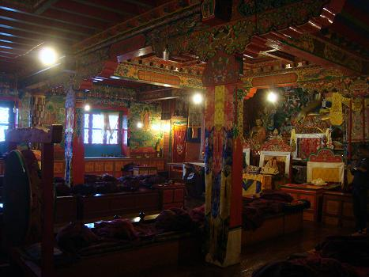
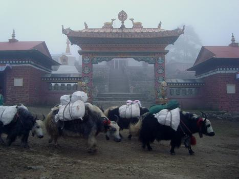
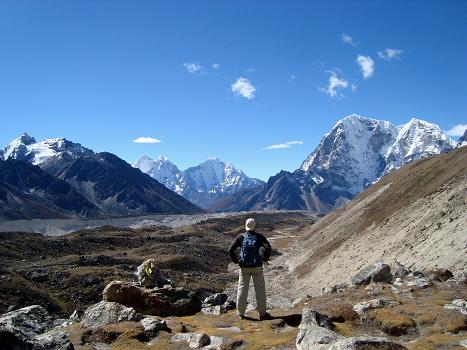
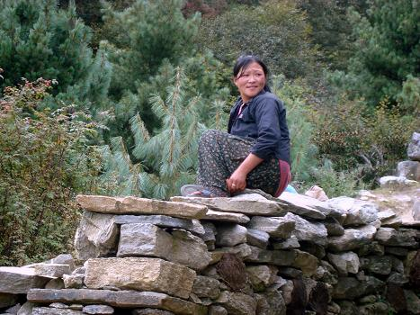
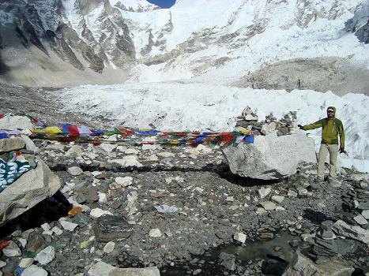
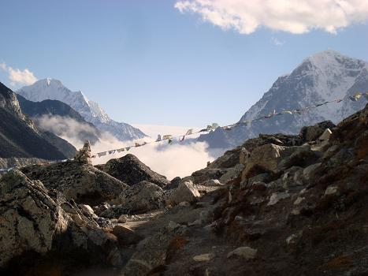

Third and last part of the report from the Nepalese mountains adventure.. walk with me on the Himalayas!

**DAY 11: COLD**

Short but very tough day. Short also because we leave very late in the morning, breakfast, packing and paying the massive bill (37.000 rupees) obviate our 6 am wakeup effort. After an inital mellow section, we face a knee-destroying descent and subsequent breath killer ascent, to finally land at about 3.900 mt to a village called Tengboche, which hosts a fantastic Buddhist monastery.

This is the first day of REAL COLD, which together with the clouds and grey light demotivates me a bit. I freeze at night, my sleeping bag is too thin, I sleep very badly and the next morning my legs ache. 

**DAY 12: CHANTING TREES**

The opening of today perfectly countermeasures the grey closure of yesterday: at 7 I attend the morning chants in the monastery, really beautiful. I had attended something like this in Japan two years ago, but here there's a different vibe: Tibet is near, and many in this region are Tibetan refugees. The owner of the lodge we stayed for the night lived in Tibet for 20 years before fleeing to the other side of the border. 
As I get out of the chamber, the Sun heats my body up! A fantastic, warm light clears the sky so that we're able to see the peaks that surround the town: we are really at the Top of the World now.

As we walk to the next destination (at about 4.400 mt), I really feel strongly the oxigen reduction. We're on the way to 50% oxigen level in the air, and every step takes more energy. Also, along the way we loose the trees: the vegetation is now some dark green grass and moss on the rocks.

**DAY 13: CASUALTIES**

We walk up to about 4.800 mt, and this is the first day with a roasting sun through a thinner atmosphere. The suncream is now absolutely essential. The walk is definitely gentle compared to previous days, but today is also the day when the most health drama happens.
Greg, Peter, Guillame and I get to destination first, so we sit down with a chai tea to wait for the others, as usual. 

A few hours later Gopal, the guide, shows up, alone. What happened is that David felt very bad due to an intestinal infection (figure out the details yourself) so he had to redescend immediately and seek medical attention. Gopal went with him to a village called Periche, a few hundred meters lower, and Joel, who was struggling with walking from the beginning, seized the opportunity to go with him. They won't make it to the Base Camp. 
We're all shocked by the news, but the drama continues: at night, also Peter and Greg seem to be victims of the same infection as David; Guillame laments headache and other mild altitude sickness symptoms, and, incredibly, same does Gopal: he feels he climbed too fast (600 meters in 2 hours and a half) and he goes to sleep.
In all this uncertainty, for once I'm the one who seems to be in better shape: I feel very good and even the cold is not bothering me as much as before! This makes me finally grasp the importance of the gear you use, beside your own body: I spent quite some money in it but it's totally worth it. The boots I'm using are the best I've ever had and so is all the rest, t-shirts, jacket, socks and so on!
Walking among a lot of other people is different, it for sure spoils the experience, but at the same time it gives you some comfort, you're never alone and you will never get lost.

**DAY 14: EVEREST BASE CAMP!**

Today's walk is technically not very demanding, but we are ascending from 4.900 meters and the lack of oxygen makes it extremely difficult. Ten steps and the heartrate skyrockets, the breathing is difficult and you feel like you can't get enough air in your lungs. The landscape is totally lunar, the only thing we walk on is rocks. We get to Gorak Shep, for lunchtime: in the afternoon, we'll do a round trip to the Everest Base Camp!
Without backpacks it's slightly easier, but still a killer walk to 5.400 meters, the highest point I've ever reached on the planet! As we walk there in the cloudless sky, the summit of Mount Everest is so close it seems you could touch it just stretching out your arm!

What an amazing feeling to get there! An incredible sense of accomplishment, unparalleled during the trek! We are right next to some incredible glaciers which, by melting, create all the streams that become rivers thousands of meters below. I've never been in such an environment before!
On the way back, I begin to experience the altitude sickness symptoms. By the time we get back to Gorak Shep, my head hurts and I feel dizzy, so I drink some water and go to bed. Luckily, one hour power nap rebalances my body and I'm ready for a great night in the cozy hall of the lodge, where John and I improvise a concert with guitar and harmonica respectively! A lot of singing and fun, special mention for "Oh Susanna", "Aude Lane Syng" and "Blowing in The Wind"!
At some point at night I go outside the lodge to pee, and I witness such a rich sky that I'm not sure I've ever seen a similar one, or at least not in a long time. The Milky Way is so intense, there are so many stars up there, the sky is all lit up! Too bad that the cold is humanly unbearable and I have to promptly go back in.

**DAY 15 TO 17: DESCENT**

Mission accomplished, now it's time to descend back to Lukla to catch the plane that will bring us back to Kathmandu. From here on, we'll be walking down the same steps we walked on the way up. So what before was discovery now is experience, and we are the ones who get asked by other trekkers "..how far is XYZ?". The descent is very steep - just as steep as it was on the way up - On the way down my knee hurts a bit more, it reminds me of Norway but not half as painful. Also, I get a bit of a cold, for a couple of nights I'm all clogged up but well, if these two annoyances are the tax to pay to have been at the slopes of the highest peak on Earth, then I can be happy with it!
On the second descent day, we notice how the tourist flux is now even more than before: we cross caravan of people ascending on the same way. They're mostly people in their 40-50ies, coincidentally Canadians. Someone climbs with the iPod on, someone climbs while writing stuff on the iPhone, someone has his iPad ready. It feels like Apple has conquered Everest before them, and the guiding sherpas have to do a lot of motivational work, pushing people up when they're tired. At some point the sherpa behaves exactly like the dudes who spur the yaks up.
The day before getting to Lukla is very special: being a long day, Guillame and I start to push from the beginning, but the effort is eased by the fact that we're now a lot lower than what we've been used to in the last days! The difference is huge: now to recover from a quick, steep climb is enough to walk slower instead of stopping, we get so much more oxygen that is a blessing for our heart, used to make to the most of any small molecule and to have to pump a lot more blood in circle to carry the same amount!

The Emperor is now out of sight, unmovable on his throne. It's remarkable how you never get to see it in its entirely, not even when you're touching his feet. You are given to see the obsidian summit, which stands above anything else, but the rest is always shielded by other lower mountains. Exactly like guards and courtiers always protect an Emperor.

