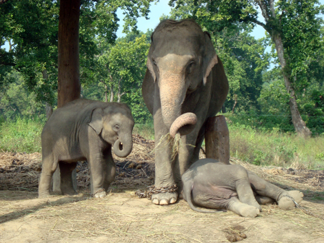
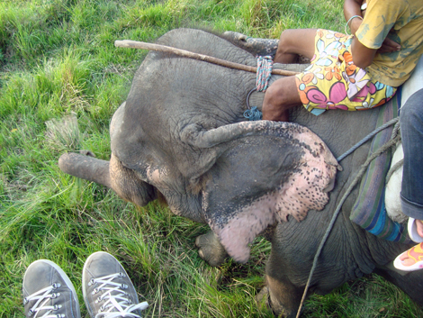
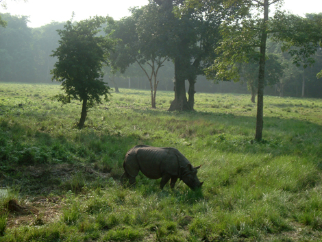
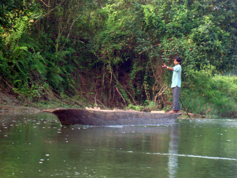
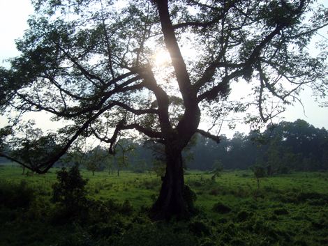

The next thing to visit in Nepal after Kathmandu was the Chitwan National Park, but first I needed to take care of another thing in Kathmandu: the VISA extension. Upon entering the country, I had purchased a 30-days VISA as I didn't have enough money (I should have selfishly followed John's advice and brought more with me, instead of leaving it for the household! :D). My stay in Nepal would actually be 32 days.\nThanks to Bhim I find the Immigration Office, which I'd never been able to find alone, and inside there I experience a bit of the Nepalese corruption. I get explained that if I pay the regular 30 dollars I would have to fill a lot of papers, come back in the afternoon, then maybe it takes a few days... I opt for the second option I'm given: to pay 10 more dollars corruption fee and there you go, my VISA extension is ready in 10 minutes!

The next day it was time to leave for Chitwan! On the way I actually stop to do some rafting on a river with a few rapids! I'd never done it before, and this was a "beginner" rafting with 8 other people in a rubber dinghy, still we went pretty fast at some points and had to row very hard! At the end we were completely wet; that wasn't a big problem as the Sun was shining, but I hadn't realized that it would be a death sentence for my Birkenstock sandals! The water penetrated between the sole and the actual sandal, and I know that's the beginning of the end.

Chitwan is very different than the Nepal I've seen so far. The country's combination of latitudes and elevations (from 60 meters above sea level to the 8.850 meters Mt. Everest!) gives it a broad spectrum of climates and environments: Chitwan is indeed more like a tropical region, and for the first time in my life I slept under the mosquito protecting nets! Houses here are huts made of stones, wood and mud, and people's appearance is different.

This park is also a World Heritage site, and the activities you can do are all nature-related. We visited an important Elephant Breeding Center, which actually holds a world record: the first documented birth of twins elephants, both of which seems to survive well.

Another peak is the safari in the jungle, riding an elephant!

One night,  we looked at an amazingly starry sky with a few Germans and a Nepalese girl. For the first time I was able to spot the Orion Belt in all its splendor, and we even managed to see some 10 falling stars! I remember almost all the wishes I expressed and who knows, maybe they'll become true someday.\nAnother fantastic happening in Chitwan: following Greg's advice, I let a local barber treat myself. It's fantastic! After the shave, the guy also provides a relaxing massage! It's also a thrilling experience, as this unknown person holds a very sharp razor right next to your throat and could easily kill you in seconds!

The only part of the Chitwan experience you'll regret is the journeys to go there from Kathmandu and back. To get an idea of the bumpiness, imagine the crappiest and most poorly maintained road the world, full of holes and ride it for ten hours drive on a bus with squared wheels. It's so bumpy that at some point you'll feel that your brain is moving independently in the skull. If you're very lucky - and I was on the first journey - you also get this high pitch, repetitive, brain-eroding Nepali music, played through 50 years old speakers that sound like monkeys having sex on a spike bed.\nIf you survive the journeys, the rest will be a fantastic reward, spectacular sunsets included!

