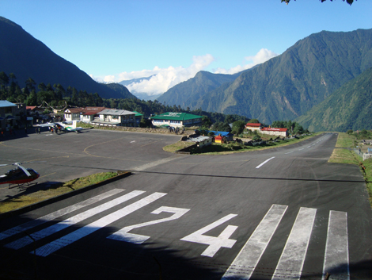
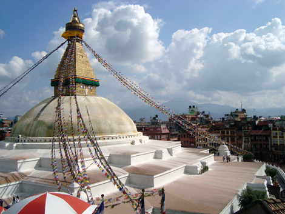
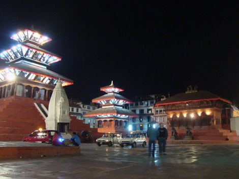

I've been 5 days away from any electricity, hence the lack of updates. Future posts will explain it all!

Once made it to the Everest Base Camp and back, another challenge was right ahead of us: getting back to Kathmandu alive. We had a flight booked from Lukla, whose airport is a tiny airstrip surrounded by mountains, and it's one of the [most dangerous ones](http://www.worldinterestingfacts.com/infrastructure/top-7-most-dangerous-airports-in-the-world.html) in the world: if the tiny plane hasn't got enough momentum at the end of the strip, your only alternative is that massive mountain in front of you.

I'd never been on such a small plane, and I have to say that the concept of "stability" is definitely different with what we're all used to! As you have probably guessed we made it in one piece to the destination airport, just in time for the last strong emotion: at landing, you only see the ground when the plane is only 5 meters above the ground, so you really have no clue whether you're on the right spot and the surrounding buildings are way too close for comfort!

After the flight back to Kathmandu, two taxis (that looked like the cars in the [opening race of "Altrimenti ci arrabbiamo"](http://www.youtube.com/watch?v=WjXvgf9WX34)) take us to Bhim's house in the East of Kathmandu. He is the brother of Gopal, our guide for the entire trek, and long time Greg's friend. His wife prepares a fantastic meaty Dal Bath for us, and the most interesting thing for me is to see a real Nepalese house from the inside.
Bhim, his wife and two kids live in one single room, directly accessible from the staircase. Four people in some 15 square meters. Two more "apartments" are on the same floor, and the shared toilet and kitchen are accessible from there. The staircase is a common space where people interact.

Lunch is fantastic. I notice that the women eat in the kitchen while men are in the "apartment". Also, for the first time since we're in Nepal, we all eat some food from the same plate, using our hands. The feeling is good, but I'm not sure about the hygienic side: for instance I had a cold and could have easily spread around the diners.
The building where Bhim lives has a ramp in front of the door for the motorbikes, which fill the city up (there are even more than in Rome!) and an egg business on the ground floor. I witnessed some "distribution" as we parted!

After lunch it was finally time to go back to the hostel and pass out after the massive trek. The first thing I did once there was charge up a bit my little Ubuntu netbook as I wanted to grab everybody's pictures. I then take it down in the hall and... it doesn't work! A total anti-climax, as Joel put it, and my disappointment skyrocketed to about Jupiter or Saturn. That marked the beginning of a crusade: me and Guillame really did our best to bring it back to life - Guillame is a Linux kernel programmer and has worked lots with hardware, so I couldn't have wished for better help, here you see him while we opened the little critter.

Unfortunately, we worked in vain. The computer decided it was too much of a cheap piece of shit hardware to work again, so Guillame took it back to Europe to ship it back to the manufacturer.

A few words about Kathmandu. Bad news first. Outside the touristic zones, it's really bad. It's like a huge slum. All the buildings are incomplete, wrecked, very poorly maintained if at all. This is the most common view.

Most streets are unpaved, so everything gets covered in dirt. Garbage is everywhere, and it is systematically burned at night (you can see the carbonized ashes still burning in the morning), which contributes to the pestilent air. Another major contribution to it is the reckless traffic. There is no other way to move around than on wheels, old cars or motorbikes which spit black smog at every acceleration. From the same source, the acoustic pollution is impressive. The frustrated honks are a continuous, overlapping flow of horrible noise, which sums up to all the other violent sounds: sirens, sawmills, building sites, people yelling. Even visually it's like being punched: the visual field is constantly full, be that ad posters on any wall or private balcony, buildings grown one above another, incredibly dense tiny shops which all sell the same stuff.

Ok, now the good: there are a few really nice, well preserved spots, some are in the world's heritages list. For instance this massive dome, one of the biggest of its kind. It's a wishing place where locals do actually go and turn these huge metal cylinders (oh, we've made so many of them spin along the trek, only smaller) or light up candles.

The place where we're staying is next to an incredible complex of temples around [Durbar Square](http://www.spinybabbler.org/art_complex/kathmandu.htm). I'm really happy to be here as it's the most beautiful place I've seen in town, and of course it gives its best at night.

After one more day in Kathmandu, all the others left, and now I'm alone on this life trek. We'll see how far I get, and how many walking mates will I find on the path!