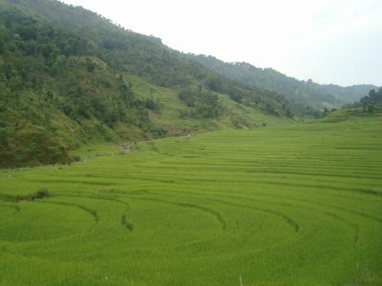
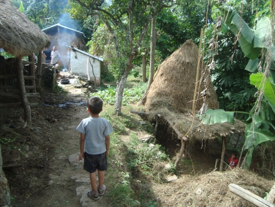
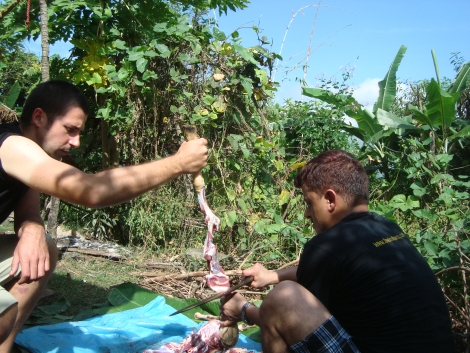
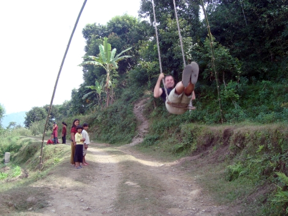
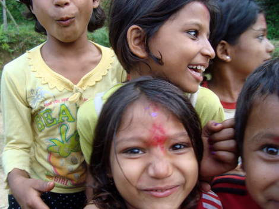
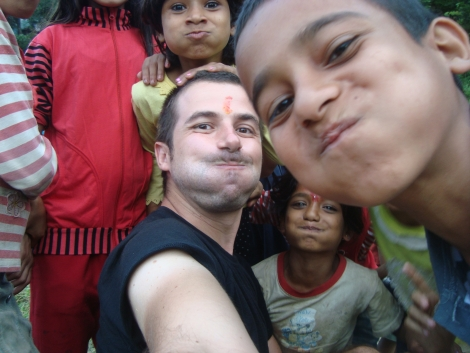

My next days in Nepal were spent in a place I would have never imagined I would have landed. It was time for the most festival of the year, the so-called [Dashain](http://www.nepalhomepage.com/society/festivals/dashain.html), which  basically celebrates the victory of the Good Gods against the Evil Gods. Our friend Bhim had therefore a few days off (like the rest of the country), and decided to take me to his little village to celebrate together!

His birthplace is a little community of people who live far away from any other towns: to get there, we had to take a bus to Gorkha and then walk for 5 hours! We went through a lot of jungle, where a few times I ran into huge spider webs, freak out and only then see the artisan - spiders as big as one of my hands! Towards the end, we walked for one hour through rice fields, which are probably the most humid place of the Universe: you almost walk in water and I was thoroughly soaked in sweat!

We finally arrived to the village, which is a handful of houses on the side of a hill, build with stones and mud and then covered in clay, with some wood used for the roof and the verandas. There is no electricity whatsoever, and the water comes from a collective fountain, 50 meters below, only a few hours per day, when everybody goes there with big metal pots to collect water for the rest of the day (and night). To get there from the house there are more and steeper steps than there are in my Amsterdam's staircase. Bhim's father is almost 80, but he still grows almost everything he needs on the little piece of land around the house: rice, spinach, lentils and a few other things. He has a buffalo (well, not like the American ones) and a few goats. The other houses are more or less the same, this would be a view of the village.

So I was given a wooden bed in the house and for four days I became part of the community! I could write an entire book on this incredible experience. Let's see how much I can get down here.

I adapted to the village life on every aspect, waking hours to begin with: life is regulated by sunlight, so around 5:30 the whole village was awake and at about 7:30 everybody would go to bed - also as there's nothing to do in the dark. The main event of the first day was the sacrifice of a goat, tradition of the Hindu religion (Nepalese Buddhists wouldn't do that of course).I didn't see the sacrifice itself as I got there a few seconds late. The animal is then shaved (using boiling water, a glass and a razor blade, the same they use to shave) and then I helped my friend to chop it. I won't publish any gore pictures (which I have in abundance), but it was a .like an anatomy lesson. The bladder and the teeth are thrown away, everything else gets chopped and later on eaten. Even the intestines, after they've been cleaned from the inside content. Brain, tendons, nerves, everything goes in. I had minor tasks (pouring water, holding parts of the animal), still it was very intense for me!

Immediately after killing the goat and tearing it apart everything is clean and looks like the biology book, but after an hour or so flies and ants arrive en masse. Dirt is highly tolerated here, especially about food, that's why the cohabitation with insects and spiders is absolutely normal. For lunch, the just-butched goat was already on the plate. First time ever that my perception goes from living animal to warm dish in less than two hours. We never get to see the whole cycle in our Western city lives; I got to see the entire process and even be part of it this time around.

In the afternoon I spent time around in the village. I had a good ride on their enormous bamboo swing, which is something every village builds for the Dashain (you've seen a similar one in my previous post). I'd never been on such a big swing before - I hadn't been on one in the last 5 years actually - and I assure you that it really swing high and fast! The swing is a major activity in the village, people gather around it and spend the entire day there. From almost any point of the village you can see its perennial swinging.

I spent most of my time with the kids. I've always loved kids, and here I had a few additional reasons: they speak a bit of English (whereas most of the adults don't) and it's simpler to get along.

I'll close this post with a picture we took where we'd all push our cheeks out! In the following parts of this story I'll squeeze in also more of my feelings about this all!

