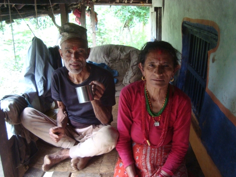

For the night, I'm given a little room built on one side of the house using wood; there is quite some space in between the wooden beams, so it is a bit like being outside.

Light and sounds make easily their way in... and not only those! During the night, at some point I wake up as something relatively big is flapping his wings right on my face! It was probably a bat, or maybe a little bird.. or maybe a rat. Whatever that was, I instinctively sent it away and fell asleep again without really thinking about it. It scared me more the next morning, when I woke up and on the wall next to the bed there was a big spider! I took a picture with my foot to try to give an idea of the dimension - but as you can see I didn't feel like putting my foot right on the wall next to it!

The second day was a bit more relaxed. No important cerimonies, just being together. Which here has a different meaning than what we're generally used to.\r\nSociality is absolutely important. I noticed that I was looked upon with a certain suspicion when I would sit alone and read a book, and in fact it feels like you're kind of supposed to be always with someone else or somehow interacting, probably because there is not much else to do, as I mentioned before. I think this is also the reason why meals often come at random times: when women are bored, they get together into the kitchen and prepare something.

How did people react to my presence there?, I was asked by a reader (hey Dorien!) Well, I was certainly an unusual presence, but not for the family I was part of. For sure, everybody in the village seeing me for the first time would stare at me with curiosity, try to say "Hallo" in English and then ask Bhim who I was, but the people in my same household took me in very naturally. I would do everything with them, such as helping with little daily tasks such as collecting water.\r\nPeople would trust me, to the point that during the afternoon I was given the taks to walk with some 10 kids of the village up to the Shiva temple and look after them. We played a few games together - thanks to a lot of scout memories, among which Grandmother's Steps (_"Un, Due, Tre, Stella!"_) and Capture The Flag (_"Rubabandiera"_)!

The only category that was a bit hostile was that of young men, say from teenagers on. Men were usually more competitive and somehow needed to make a statement about territory ownership, and maybe also show some kind of "women ownership", even though things in the village work with marriage proposal and combined marriages. I believe the primal reason behind combined marriages is to avoid too much inbreeding. Based on the stories I collected, the partner is chosen in a reasonably distant village, something between 3 and 6 hours walking. Once married, wife and kids move to the husband's family and become part of it. That is why my friend's sisters were never around but in some villages at the other end of the jungle.

At some point in the afternoon, a group of people walked singing next to our village: they were coming from further villages and were going to a temple one hour away to sacrifice the animals that you see marked in red in the picture.

Ah, I need to mention something expressely for Sergi: the article that shocked us about how many people in India, Pakistan and surrounding areas are supposedly neo-Nazi was a hoax, I'm 100% sure. Both in India than here, swastikas are EVERYWHERE, even on planes and on company logos, and that's because of its [original meaning](http://history1900s.about.com/cs/swastika/a/swastikahistory.htm). For instance, in the village I used to sleep under the cardboard box of a soyabean oil company called "Swastik" that was used to prevent humidity to come in. I can guarantee you that the most of the people in this area of the world don't know that Nazi existed and possibly don't even know that something called "Europe" exists far away and that stuff happened there.

Like probably every social photographer knows, once that you're part of the community, onke the villagers know and trust you, they will ask you themselves to be taken on picture. That's why I was able to take so many - those that end up here on the blog are really just a tiny fraction. I have actually taken almost more pictures in four days at the village than in three weeks of trek for the Everest! These are Bhim's parents, almost 80 years old and still strong like an oak. They are sitting in the veranda of the house where most of the time is spent and where Bhim's father always sleeps, in order to watch over the house.

One last thing that I notice in all the villagers is how much knowledge they possess about what surrounds them directly. This really impressed me. Everything that they use, or drink, or eat, they know its story and how it has been grown and processed to become the way it is now. They know how their house has been built, and probably they have built it themselves (which is true in my friends case). They know where their food comes from, and probably they have harvested / slaughtered it themselves. They know what is inside a pillow and where it was before, probably because they have collected and processed it themselves. The list is endless. How much do we know about the stuff that surrounds us? Not much I would say, because of all the "compartmented knowledge layers" that the society has put in between us and the stuff that we have around.\r\nProbably because our knowledge tends to be more and more specialized: each of us might have a good understanding of his discipline, but the rest is vaguely known. Their knowledge spectrum is broader: from growing vegetables to building houses, from plumbing to proper worshipping, everybody knows everything he needs to carry out these tasks. Of course, things in our side of the world are far more complex, which makes such "universal knowledge" simply not sustainable. But it was interesting to think that long time ago also our lands had no secrets to anyone.

