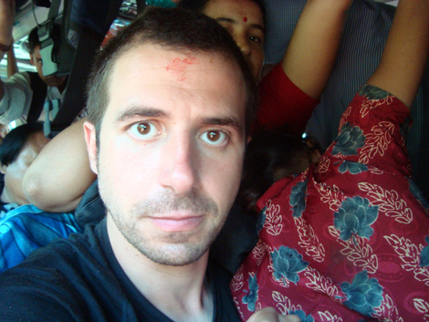
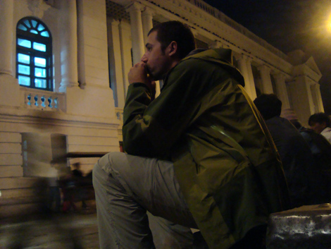
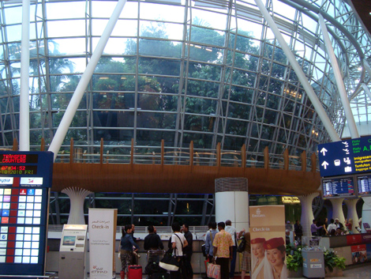
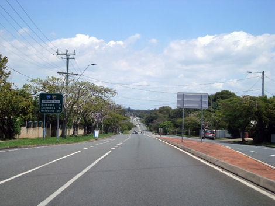

After any fantastic time somewhere there is a necessary journey back.. and so there was one from the village where the story in the previous posts took place. And what a journey it was. It took us 13 hours to go back to Kathmandu.

After the 5:30 wakeup, Bhim and I left at 6 to walk in a different direction from the one we'd come from. After about one hour we reached another village, where maybe a bus would have arrived at some point - and it actually did! We got on this bus which was almost empty, but this privileged condition wouldn't have lasted long. As we proceeded on the bumpy soil (you can't really call it "road") we collected more and more passengers, until this bus ride became the busiest I've ever been on. The corridor was so full of the usual colored crowd that it literally overflew: I was on the aisle seat but was firmly compressed against Bhim, and at some point my head was actually laying on someone's chest and I couldn't move my left arm anymore - watch to believe!

In addition, the bus stopped 1000 times to let more people on the roof or let people down (every time it would take long minutes) or for various small mechanical problems. Four hours of this pleasure and we arrived to Gorkha, where we had lunch and at noon we took another bus to Kathmandu.

On this new, delightful bus, the room to sit was so small that my legs didn't fit and had to be stretched towards the corridor. The music was terribly loud and the wind was very strong as Bhim wanted to keep the window open the whole time. At least there were the most beautiful girls I'd seen in Nepal so far, all with their kids and their men (mostly older than them).

I was looking forward to arrive in town before 7pm as I wanted to recollect my backpack from Bhim's office. But that wasn't going to happen. The journey was so long, slow and with so many stops that we only made it for 7:30 pm, when the city was totally dark, and I spent another night at the hostel. The next morning I went to Bhim's office to collect Ferrino (he hasn't been very lucky so far, has he?) to find out a funny happening: the office had undergone a flood in the meantime, as the water storage below it had some problem.

This helps me highlight another attitude that I think I have noticed in people from this country (and I guess it'd apply to people from all similarly poor places). The way they face unexpected problems is remarkable. They just take it without turning a hair, and find a way to fix it. So far, so good. But when it came to me, they applied the same attitude, so Kamel (Bhim's friend that was in the office at the moment) looked at me with a big smile and said "hehe, it's wet! Hehe just laundry and then ok!"

Same when we traveled to Bhim's village four days before: I didn't know that after Gorkha we'd have to trek for five hours, and I found out only 30 seconds before. Big smile on and "hehe is it problem to walk for few hours?".

The last two days in Kathmandu were actually spent recovering from a bit everything, strolling around the town and planning the next move.

I spent some time with a French girl who we'd met on the Everest trek and who works in Kathmandu for a tourist agency. I've had some lovely walk around the city and played the harmonica as a last goodbye to Durbar Square &amp; Basantapur, my favourite spot in town.

Allright this post has already grown longer than I thought. Soon it was time to move to the airport! The first flight was a short Kathmandu - New Delhi; oddity of the journey, the guys of Royal Nepal Airline (although Nepal isn't a monarchy anymore) had assigned me and another person to the same seat! Brilliant.

Then New Delhi airport: I had to wait there for TEN hours! I wisely stayed in where the shops are (remembering how difficult it was to get in there, which I described in the post [Rush](http://ticofab.io/travel/2010-09-19-rush/), and the time passed by quickly, thanks to a book that Nick gave me at my Haircut Leaving Party and to a German girl (hey Christa!) that offered me the 200 rupies necessary for a snack as I didn't have any and my cards were not working!

Then the flight to Koala Lumpur, on which I talked to a few people, in particular I listened to incredible stories from a Australian / Dutch lady who used to live in Indonesia before the war (the Country was still a Dutch colony by then) and was therefore captured by the Japanese forces and imprisoned in a concentration camp for three years!

The flight connection in Kuala Lumpur was short, but it let me see something cool: they have a dome in which they recreated a Jungle environment a bit like it happens in European botanical gardens. You can walk in for free, it's hot and humid as the aforementione greenhouses... and only then you realize that the "dome" is actually an open air space! As in, it's OUTSIDE the airport, which is in turn a "greenhouse" where they recreated European climate!

The next flight finally took me to the land where I am now. Those who don't know, guess which one is it from the image!

ciaooo fab