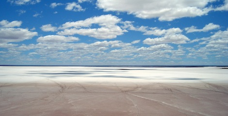
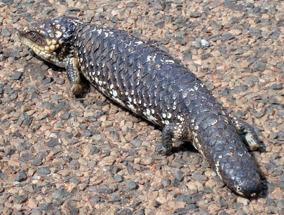
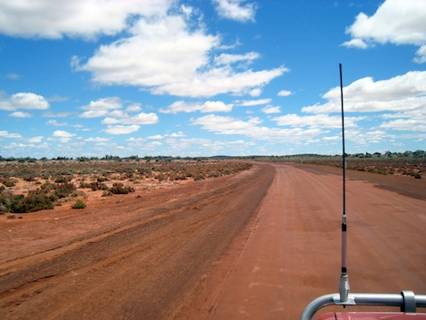
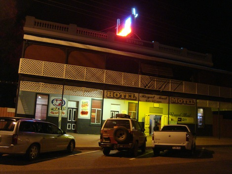
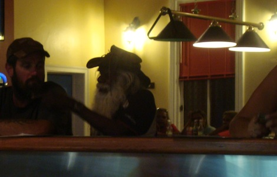
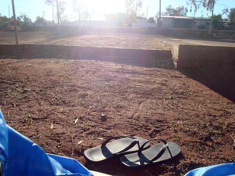

We left Kalgoorlie at about 8, after having had a modern, continental breakfast at the hotel. The morning road was quite smooth, except a deviation that we took to go see an important nature / artistic site: a vast, flat salt lake ([Lake Ballard](http://www.australiasgoldenoutback.com/en/Things_to_see_and_do/Art_culture_and_history/Pages/Gormley_statues.aspx)), where 51 "primitive" metal statues have been scattered all over. Would have been very interesting in principle, but it was deadly hot and there were too many flies to actually enjoy it. We climbed on a tiny hill to check the view out and then went back to the car, also because the statues were truly horrible.

Ah, there's a great entry today for the "New Animal of the Post" category. Just after the lunch stop, an odd lizard crossed our way. Its body was so stubby and the head moved jerkishly. And its legs were so tiny and they practically didn't bend, so that the funny lizard was SO slow that we had all the time to go back, get down the car and take pictures. From an evolutionary point of view, I believe this animal was just one step above the aquatic life and I wondered when it actually stopped evolving. Crocodiles and turtles are said to be among the oldest creatures on Earth; I'm pretty sure that when they played at the kindergarten, this lizard had already applied for retirement.

The drive to the next destination was the toughest so far, 175 happy kilometers on a red, desert gravel road. True outback drive.

The night was probably the funniest part of the day. We arrived to Meekatharra, which is a true outback town: 4 buildings of which 3 saloons and a fuel station. We had quite a few drinks in one of them, and got to meet a representative slice of population, which there switches significantly to Aboriginal. There were at least 15 of them in the bar, most of whom part of the same family. Here you can see the father of many at the bar.

It was interested to chat with them. Unfortunately, most of them stinked of alcool, and generally looked pretty wasted and poor. I made the bug mistake of give up and buy one of them a drink, and from that point on they would ask for another one every time that they would come next to me. At least I also got told that I have a "very lovely ass".

Exhibitions of "traditional art" and museums about Aboriginal life are everywhere, but statistics about their present conditions are awful. Every city has some Aboriginal museum, they describe what their life was before the colonization, they admit that they destroyed all of it and they can't say sorry enough. There are pictures of ministers shaking hands with black, big nose people, upon recognition of their rights with a delay of some 200+ years.

My cynical feeling so far is that Australian people tend to cling to the Aboriginal culture to showcase a past that they don't really have.

Personally, I found it unusual when I first traveled to the US. Being Italian and grown up in Rome, surrounded by the most majestic ruins and history in the world, I've always had a past to look back at, be kind of proud of and to use to understand my present. But in these "new" countries, what's the past they should look at to understand their present? English history, probably, a country at the other end of the world that, in this case, used Australia as a penal colony. I reckon that is not very exciting.

In no Australian museum you will see "life in London in the late 1700". It's not very poetic, that's probably why they show old Aboriginal graffiti and boomerangs instead. But the English lifestyle and weapons, that's what they should show. Because in nowadays Australia there is NO TRACE AT ALL of Aboriginal culture, except when they are quoted as drunken troublemakers. Outside the museums, of course. Does this remind you of Native Americans, anyone?

We decided that the rooms in the hotel were too expensive so we went for camping at a nearby Caravan Park: dirt sites and water facilities. I slept great in the tent and this is the image as I opened it the next morning, with my 3.99$ flip-flops waiting for me.

