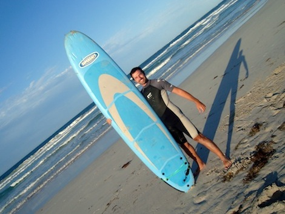
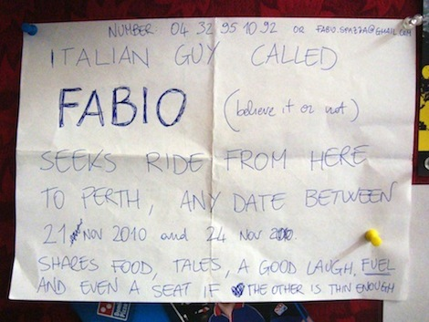
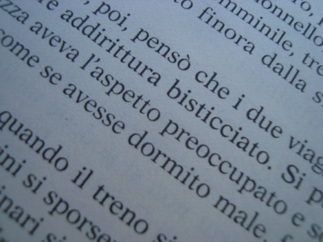
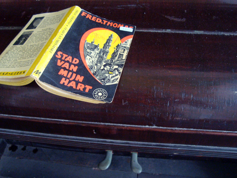

In the last post we'd just spent a night in Meekhatarra... and that was actually to be the last night of the road trip. That day, Becky and I came to the conclusion that not only we live at the antipodes, we're also antipodean people. We thus decided to pull the plug of the road adventure one week earlier than scheduled. Instead of driving further North, we headed for the coast and just after lunchtime she dropped me off at Geraldton.

So there I am, alone again. The first hours in town were definitely quite frantic and anxious. I was walking under the sun with all my stuff + food on my shoulders, and couldn't find accomodation. I even considered buying a small tent to go camp in the wild, but in the end I was able to enter a single room in a sleazy hotel that was also a [skimpie bar](http://ticofab.io/travel/2010-11-13-golden_skimpies) and a liquor store (sic). There, I kinda recollected myself and started arrangintg stuff for a better tomorrow... and indeed the next day the wind changed for the better: I found a bed in a great, cheap hostel full of friendly people and in the afternoon (just 24 hours after arriving in town) I was on a sunny beach attending my first surf lesson!

Surfing is really a lot of fun! Within the first lesson I was already able to stand on the speeding board for... quite some seconds. My instructor [Keith](http://surf2skool.com/) is a very cool guy, and I can now understand what's the story with all the people who go nuts and drop everything they have to move to some sand island and surf all day!

The only downside of this lovely town is its constant wind, strong to the point that all trees grow up bent on one side - which I had only previously seen on top of some mountain! You would think that it's good for surfing but it actually isn't: the waves are maybe a bit higher, but the wind is destabilising and it makes it harder to stand on the board.

In this new hostel situation, I am also trying to save some money while I'm here - the road trip was being quite expensive between fuel and drinks. So I'm visiting the supermarket quite often, and one of the funny thing I noticed is that special offer &amp; cards here are mostly related to saving on fuel: like, every 30 dollars in Woolworths you get a 8 cent/litre discount on gas. One could argue that, this way, they loose grip on all those people like me who don't care about fuel, but actually this kind of marketing is a perfect indicator of the role of cars here. Woolworths doesn't care about people who don't have a car because... we are so few that we are completely neglectable. Everyone here has got a car. Cars rule. While in Amsterdam everything is built around bycicles, here it's all about cars. There is one crossroad here in Geraldton where the waiting time for pedestrian is RIDICOLOUS, and you might see the same lane getting the green twice before you! The Greyhound bus service isn't capillary nor cheap - that's maybe why I looked for a ride at the hostel:

This hostel also complies with another feature of most toilets I have tested in Western Australia: when you open the "cold" water tap, the water is warm anyway as the pipes are exposed to the sunlight! Traveling on this side of the world, I also get to meet a diverse traveling crowd: I have a lot of Taiwanese and Japanese mates - never seen a Japanese in a hostel before -, mostly here for work. One day we had a barbeque to celebrate the birthday of a Taiwanese girl. Well, I'd never had octopus tentacles at a barbeque!
I am also finding time to read my books, which is the second time this happens in two months of traveling. The first book I read was '[Ignore Everybody](http://gapingvoid.com/books/)' , a fantastic birthday present from [Nick](http://twitter.com/durdn). Now it's an Agatha Christie classic, which I actually bought in a second-hand bookshop in Sydney. Maybe some Italian reader can guess which one it is from a few words?

I have actually just finished that book, so I went to another second-hand bookshop here in Geraldton, and there's a nice story here to tell. I went to the "foreign language" section, to find that she only had two italian novels and pretty crappy ones too. I then spent a good 20 minutes checking the Dutch books, and finally chose one, a 1961 book for 3,50 dollars. As I show it at the counter, the old, red hair woman examines the price sticker and says: "Ah, I recognize this sticker, it's the kind that the previous owner used, and that means that this book has been here unsold for at least 5 years. Just take it!"
That book now is now for me a lot more precious than three dollars and fifty cents. Such little stories always shed a positive light on your day.

