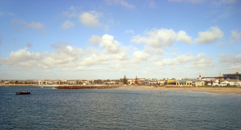

I'm writing this post on my last day in Geraldton. As a hint of how much I liked it, consider that I planned 4-5 days here but ended up staying almost two weeks... and only because I had a damn plane to catch. I stayed in a wonderful hostel (that here is called 'backpacker'). They do cheaper weekly rates, so the result is saving money and having a blast at the same time. In this post I will tell something about how easy life is here.

Most of the guests actually stay here for months, at 130 dollars a week. Everyone has his daily routine: wake up in the morning to go to work, grocery shopping in the afternoon, cooking and all the rest. And everything is shared: bedroom, kitchen, living space, toilets and showers.

The resulting atmosphere is of total "togetherness", to the point that after some time it really starts to feel like a family! You maybe get the same with housemates, but here the numbers are different: we're talking 30 or 40 people! The hostel is right in front of the beach, so any day we'd go for a swim, a dive, or just some fun: in the pyramid pic I am with a German, a French, two Japanese guys and a random Australian Santa at the top! Perny in Amsterdam will for sure approve.

This is the beach in front of the hostel. We often swim to the platform you see on the left and dive from there. No worries mum, there are no sharks in Geraldton!

Pretty much all the world is represented here, including Europeans, Kiwis and "local" Ozzies. There are quite a few English people, who are nice but whose fun is the classic manly, drunkass Northern European attitude, and that's something that I already know well enough. That's why I'm especially happy to be spending most of my time with people from Asian countries: there are so many of them, much more than in an average European hostel. There's a big group of Taiwanese people, South Koreans and Japanese, and this crowd composition was indeed another new thing for me. The kitchen is where their presence is most obvious: the smell of noodles and other delicious, typical Asian dishes always fills the air. We even had a "mixed" barbeque where octopus tentacles were on the grill next to the usual Western food. In the next pic you see my Japanese friend Kuma (the nickname comes from the [bear in Tekken](http://media.giantbomb.com/uploads/0/9169/969466-kuma_versus_paul_phoenix___tekken_6_super.jpg)!) preparing a fish that he caught himself!

Not having to work myself, I have taken it very easy during the days at the 'backpacker'. A very common situation would be this one: doing fu*k all on the hammock reading a book!

The living room of the hostel (where I'm busy writing now!) has two tables, two couches with TV, a bar, a soccer table and a pool table, which is probably the most popular amenity of the building. I've never been very good at pool but this time at the hostel is definitely leading somewhere. My Anglo-Himalayan teacher Peter would be proud of my progresses! I'm posing next to the table with Aki, a Japanese friend that I also share the room with. He's tiny but full of energy and smiling all the time.

Another Japanese guy sums up the world-traveler spirit with the traditional Japanese wisdom. His name is Hokuto (but he is no related to Ken Shiro) and we spent a lot of time making music together with a couple of guitars, the harmonica and the djembe of an Australian girl called Heidi.\r\nWe tend not to go out at night but rather buy drinks and stay in. The owner is the nicest hostel owner you'll ever meet. He puts music on after dinner and stays with us at the tables outside. In the next pic, I'm pouring Aki some of the home-made bourbon that I was given back in Esperance!

This hostel is a GREAT place. After all this talking, I'd better write down which one it is: the [Foreshore Backpackers](http://foreshorebackpackers.bigpondhosting.com/). You might get the idea though that I spent inside the building the entire two weeks in Geraldton. It's not (completely) like that and in the next post I'll talk a bit of what's outside these 4 walls, so stay tuned!