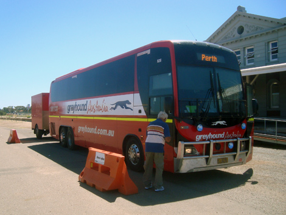
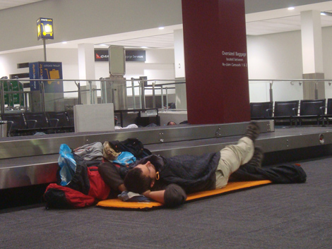

Yo yo yo (three times)!

The last night at the 'backpacker' had been full of hugs and adios. Me and the Australian girl Heidi would leave the next day; both going to Perth, with the difference that I would endure many hours on a bus while she would poshly take a plane. The next morning I went for a swim at 6:30, then met a few early birds at the hostel (among which Heidi herself) and finally left for the bus station after breakfast. The Greyhound vehicle showed up shortly after I got there.

The bus journey was horrible: I couldn't sleep due to a cute Aboriginal baby whose lungs had been replaced by a Marshall guitar amplifier, and, what's worst, the air conditioning was at galactic level! It gave me a bad headache and somehow pulled out a lot of bad feelings, so that I was pissed off throughout the 6 hour journey. Once in Perth, I spent some time walking around and getting back to see my favourite building, the Swan Tower, then took the bus to the airport, another hour of pleasure due to the driver, whose dream as a kid was obviously to be a Formula 1 pilot.
My plan was to spend the night at the airport as my flight was somewhen around 6 the next morning, so once there I began looking for a nice spot to sleep. But I also noticed that the flight was actually at 11 am! I was just metabolizing the news and wondering how could I fill 16 hours in an airport, when somebody pulled my backpack from behind: I turn around and there's a laughing Heidi! Such a funny coincidence, she had actually worked in Geraldton during the day and had just flown to Perth! That airport is clearly a coincidence catalyzer, as she also met another friend of her; the three of us spent a few pleasant hours in the airport café, so the time I had to kill had already been reduced!
Once they left, after a quick peek to the internet, I felt it was a good time to go to bed. I had slept in airports quite a few times before (the first one in Liverpool's John Lennon), but this time I decided to enter full camping mode, using the inflatable sleeping mat and the sleeping bag as blanket.

The next morning, the crowd woke me up around 5:20, and few hours later and I was sitting on the plane. As usual, I had planned to read and sleep during the flight; as usual, none of that was going to happen. I sat next to a lovely, 60-something lady from Perth, and we spent the whole flight talking! She is the first white Australian person that I have talked to whose knowledge about the Aboriginal people went beyond the "oh yeah, so sad".

She explained to me their interesting concept of time, and how it's related to the "walkabout". Their time management is completely different than ours, and so are their priorities. For instance if one of their relatives in a town 400 km away has a problem, they wouldn't hesitate to just disappear for three days, putting any prior commitment into the background. Their time culture is all about taking all the time it takes to accomplish their tasks. Same applies to reaching compromises and solving problems: they would sit down and discuss till a solution is found. All this obviously doesn't match our Western patters, and the term "walkabout" has thus long matched ideas of unreliability and frivolousness.

They had never known the concept of property nor fences. Like many other peoples, they would ask permission to kill an animal and then honour and mourn it before eating it. When the colonizers arrived and started the first pastures, Aboriginal people would just ask their sheep if they agreed to be eaten, and after the granted positive reply, they would simply take it - which of course made them immediately be seen as thieves.

A recent-history, tragic mistake was made in the sixties. By the time, most Aborigenes were not treated by the employer with equal rights as white workforce: for instance, they would be paid in goods (like flour) but not given a salary. With best intentions, a law addressed this inequality and employers were obliged to pay the Aborigenes exactly like the white men. What happened at this point though, was that many employers didn't have enough money to pay all of them, with the result that they kept the 2 or 3 best workers they had and sacked all the rest. This triggered a massive shift towards unemployement, homelessness and alcohol abuse.

What then is probably the worst of all modern-day Aboriginal tragedies is the [Stolen Generation](http://www.racismnoway.com.au/classroom/factsheets/52.html). Kids were removed from their families and brutally thought white principles, possibly in Christian schools. From the website,
<blockquote><em>Children were removed because the Aboriginal race was seen as an embarrassment to white Australia. The aim was to strip the children of their Aboriginality, and accustom them to live in a white Australia. The tragedy was compounded when the children, as they grew up, encountered the racism which shaped the policy, and found themselves rejected by the very society for which they were being prepared.</em></blockquote>
Still nowadays there are Aborigenes who don't know who their parents were. Even more importantly, they don't know which land they belong to, when the geographical coordinates of their tribe and birthplace is an essential part of their spirituality. This generational disgrace is what the [Sorry Day](http://en.wikipedia.org/wiki/National_Sorry_Day) is about.

Why is it that for every country I visit, be it as rich as the United States or as poor as Nepal, I have to learn about the atrocities that Europeans committed to the indigenous populations? It's a truly FUCKED UP feeling.

