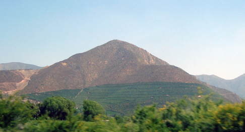
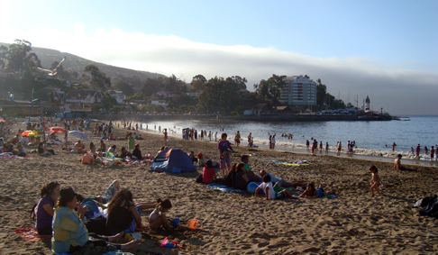
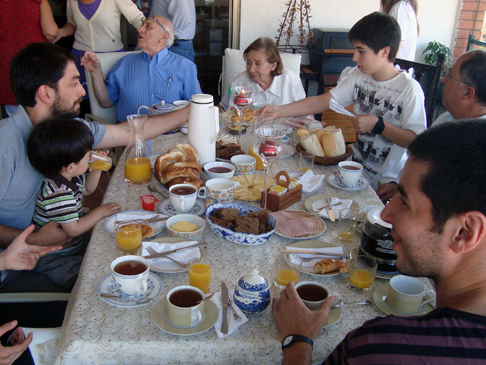
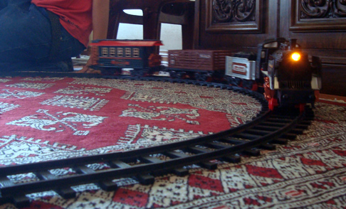

The first time I spent Christmas far away from my family was in 2004, when I was living in France. Life there as an exchange student was so good that I simply decided not to go back. With my Brazilian friend Stenio, who wasn't going back home either, we took my car and left for a massive trip through the Norhtern European snow... What a fantastic time it was! Anyway, back to 2010.

I'm a lot further away from home, this time around. Not only this: if you belong to the vast majority of the Earth's population living in the Northern Emisphere, you can't imagine how weird it feels to have a hot, summery Christmas until you live it.

We had a "pre-Christmas dinner" here in Valparaiso on the 22nd of December, after which I was invited to spend the festive weekend with Daniel and the family of his partner Luisa. They live in a town called La Ligua, two hours north of Santiago and closer to the coast, so I had the opportunity to see another hidden corner of the country! I went to Santiago on the 23rd, and at night I met Paulina, a friend of Ele, who showed me a few bars of the capital. On the 24th morning I went with Luisa to the cafè where she likes to work in the morning, a cute place called Espresso.

Once Daniel was done working in the afternoon, we stuffed the car up and left, destination La Ligua. It took us some effort to go through the massive traffic jam to get out of Santiago, but once on the way I could learn something about a fruit that is absolutely essential in Chilean food: the avocado, locally called _Palta_. I had it of course before, but it was never part of my daily thinkings. Here, I learned to love it and embed it in any meal, be that breakfast, lunch or just an afternoon snack. It was then very interesting to drive through some avocado plantations, and Daniel explained me something that I would have never thought about but which makes a lot of sense: the best spots to grow avocado are the sides of mountains. Why that? Because the trees shade each other less, individually getting more light! This helps the fruits to become more oily, and consequently tastier.

Once in La Ligua, Luisa's sister took me out for a walk in town. This place is best known for its clothes, cakes and ice creams. And, being summer in full swing, we couldn't avoid one! I have to say, that was the ice cream that most tasted like Italian ice cream I have ever tasted outside my home borders. Even the cone was faithful!

The 24th evening is the most important moment in Chilean Christmas. As tradition asked, before dinner we all sat in the living room and read some passages of Jesus' history, followed by some prayers. Being myself fairly distant from the Catholic religion, it was long time I didn't actually sit down and collectively prayed. This, together with the mild homesickness that such an intimate situation evoked, brought me to tears, which I goofily tried to hide with no success whatsoever!
After that we had dinner and began to open the presents, which were almost all for the little Domingo, the beautiful son of my friends! The dinner went on till late. I had one of those invaluable talks with Luisa's father, who was a university student when the [Chilean coup d'etat](http://www.efootage.com/stock-footage/66043/Chilean_Coup_Detat_Allendes_Suicide/) took place in 1973, clearing the way to Pinochet's dictatorship. There is nothing like hearing such stories from who was there.

The next day we reached out for the oceanside - two beaches, no less! Racketball and diving in and out of the water. Which was ice cold by the way. To lay sunbathing on the sand while the ice cream kiosk behind is playing "Jingle Bells" is simply priceless.

Another very important and different Chilean Christmas custom is the _once_. Families and friends alike join each other in a house where the table is big enough, and the meal is not a proper dinner but rather an informal collection of snacks: small sandwiches, tea and coffee, little pastries.. a kind of late High Tea, that starts around 7 pm and goes on till late at night. I attended two of them, one with Luisa's family and one with Daniel's, once back in Santiago. The latter on a big terrace with a majestic view on the cordillera at sunset.

That same day the usual Christmas phenomenon took place: all adults revert to primary school mode and get all excited with the toys for the kids. We all sat around and created true art with the kids' colored paste and played with the timeless train model. Nowadays with smoke and noise!

