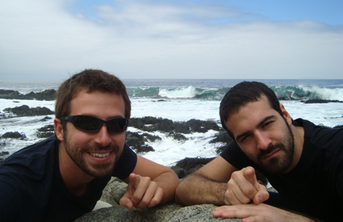
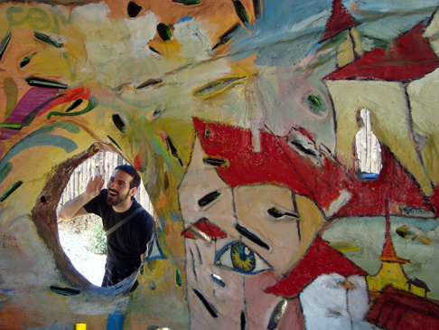
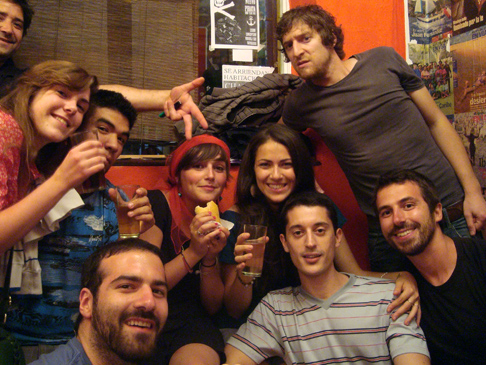
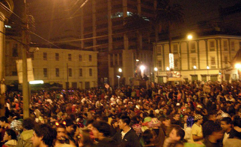
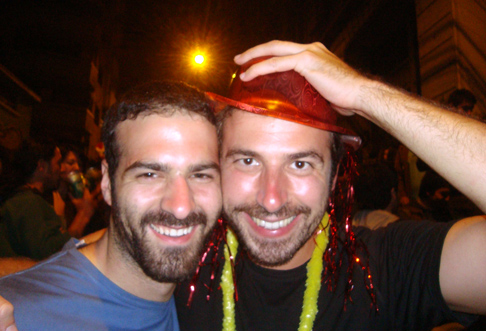

Hey there! Second appointment with The Adventures of Fabio & Guido!

Having spent nearly a month in Valparaiso, what I firstly wanted to show Guido were... my friends! After one week away, I was really looking forward to see Mauro and Anna again, so on the first day back we climbed the hill up to the bakery where Mauro works. We spent quite some time and pesos there (the latter for the "titanic" [_empanadas_](http://cachandochile.wordpress.com/2010/09/08/september-in-chile-una-rica-empanada-caldua/) that he makes), and at night we hit a few bars. The last one, called _Pajaritos_, hit us unexpectedly hard and we spent most of the following day trying to recover.

One cool thing that we visited is Isla Negra, a little village on the ocean, south of Valparaiso. The main attraction there is [Pablo Neruda](http://en.wikipedia.org/wiki/Pablo_Neruda)'s third and last house. This house offers more than the other ones as those were destroyed by the military after the dictatorship began in 1973. This one was spared as it was located in a small town, where everybody knows everybody else, and the "benevolence curtain" was able to protect the house from the soldiers' vandalism. The house is actually a huge mansion on the beach, architectonically reminding of a ship. Neruda was an absolute sea lover, although he never was a sailor. Another thing he loved was stuff. Yeah, stuff. He collected all sorts of things, of all forms and dimensions. Seashells, musical instruments, bottled ships, embalmed animals, masks, boats' figureheads and many more useless objects. Too bad it was forbidden to take pics inside the house. Comfort yourself with this shot we've taken just in front of the house. It tries to replicate a picture we took in 1998 on a lighthouse on the Aran Islands, Ireland. 

It probably doesn't deserve this much attention, but we loved Isla Negra's bus stop. A structure made out of concrete and glass bottles. Very colorful as well and with a sort of window, to look at what is still unclear.

The other main event I need to talk about in the post is how we spent New Year's Eve! Due to a last minute's change of plan, we ended up partying in Mauro's bakery! Never ever in my life I would have imagined that I would spend a NYE's dinner in a bakery. The food was coming of course straight out of the oven (on the Facebook page of Famsterdam Life you can see a picture that we took from INSIDE the oven!), and the fun thing is that for a while we kept the shop open, and people kept coming in! They would find an unusual atmosphere for their bread needs, and many actually ended up staying with us drinking for a bit!

Once reached the proper [Kalimotxo-fueled stage](http://www.yumsugar.com/Happy-Hour-Kalimotxo-3179240), we headed up for a viewpoint on a neighboring hill. During my time in Chile, everybody was constantly telling me that Valparaiso is one of the best places in South America to celebrate NYE because of its bay. Check it out [here](http://maps.google.com.au/maps?f=q&source=s_q&hl=en&geocode=&q=Valparaiso+chile&aq=&sll=-16.759059,145.67272&sspn=0.085144,0.130291&ie=UTF8&hq=&hnear=Valpara%C3%ADso,+Chile&ll=-32.994267,-71.591034&spn=0.14916,0.260582&t=h&z=12) to have an idea: fireworks take off from each town on the bay, which result in a spectacular show with massive reflections on the ocean! Add that it's possible to watch it from the top of a hill, and add an incredible atmosphere afterwards, when the streets are literally filled with people dancing and having fun. This is indeed what we found when we redescended towards the center of town!

We stayed there for quite a while, the weather was fantastic and the people were all happy and friendly. A fantastic night full of good vibes, this was definitely the nicest New Year's Eve party since 2006 at least. Let's close this festive post with another festive photo and stay tuned for our next adventures. To that extent, consider "liking" the FB page or subscribing to the blog's RSS feed!

