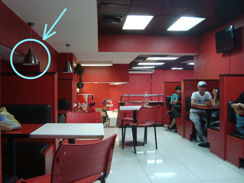
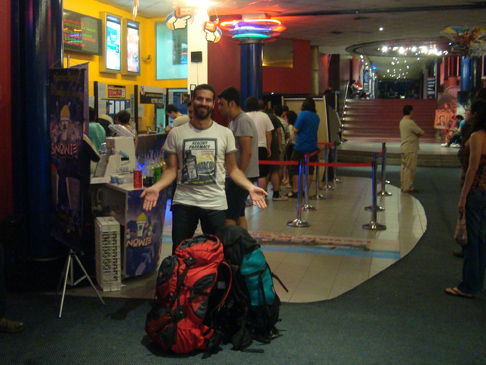
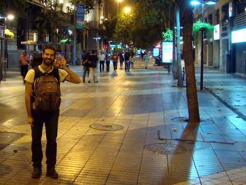
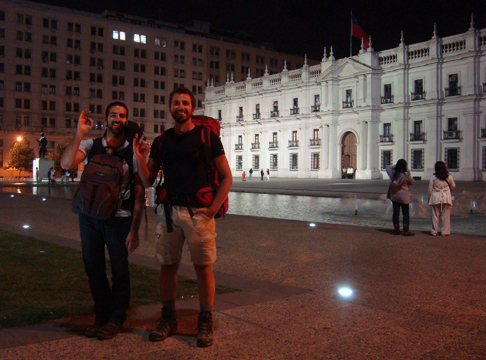
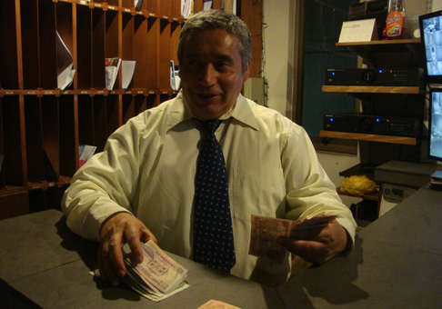

When I was working on my final Master's dissertation, back in 2005, I used to travel everyday to the office with my mentor Victor. Everyday we'd pass by a little construction, on which somebody had written in Roman dialect a sentence that could be roughly translated as "We're so busy getting to the destination that we forget the beauty of the path". That writing is long gone but its meaning is still there. This post will be indeed about a path. The one that connects Valparaiso to the very southern tip of the continent: the Patagonia.

On the first of January, Guido and I stood up after only 3 hours of New Year's sleep and began packing for the next adventure. Everybody had told us that the weather gets cold, very cold down there, so I swiped the dust off all of my Himalayan equipment.
We took a bus and reached Santiago, which seemed to be dead: the combination "first of January & Sunday" doesn't forgive. We were pretty hungry and the only open food venue we found was a place called Telepizza. If we'd known what the experience would have been, we'd probably chosen to starve. The place seemed to come out straight of some cyberpunk future, where one wakes up after a nuclear cataclysm without any knowledge of who nor where he is.

- There wasn't a single window. Everything was red with neon lights. Imagine "The Shining" by Kubrick.
- All the lamps above the tables lacked the bulb, contributing to the general sick shadiness.
- It was hot as hell, you'd sweat just by sitting there.
- Put in decadent, dirty toilets. Chopped off electric wires came out of the wall, next to random black exposed pipes and a sink which poured water all over place.
- There were pictures of smiling young families, which added a lot of tension and made me think of the movie ["The Road"](http://www.youtube.com/watch?v=hbLgszfXTAY).
- When the pizza arrived, things only got worse. My mistake of asking double cheese resulted in a horribly liquid blob, oh God, it was just awful, very unpleasant to eat and my stomach hurted later on.
- This will be my fault, but as a final gift from that cursed place, I put my sunglasses in the the top pocket of the backpack. But you'll find out about this only in the next post.

After this dreadful experience, we decided to go to the movies. Another quest among the deserted streets finally lead us to a nice underground cinema. We walked in with our huge backpacks, and even took them into the movie room itself! It somehow felt good - it was like your house never abandoning you. We watched [Megamind](http://www.youtube.com/watch?v=kPVbYBYN--I) and, mostly because of my Superman reader record, I really enjoyed it!

We then walked till the bus stop. The pictures below show you two beatiful features of Santiago: the treelined pedestrian walks (that I mentioned in [When Italy and Chile Unite](http://ticofab.io/long/2010-12-30-when_italy_and_chile_unite/)) and the Moneda's Palace, that I described in previous posts, this time straight, at night and from the other side. Wow, it sounds like I'm describing a porn site.

It was already 10 pm, time to catch the bus to the airport. Except, the bus didn't come. We entered a nearby building and asked the friendly concierge. It turns out that on Sunday the bus stops at 5 pm. We called a taxi, and while we waited (a good half an hour) the guy began to entertain us. His name being "Washington" in honour of his father who went to study in the US when he was born, he is going to buy a motorbike and spend 10 years touring the world (this is the exact plan). He loved the Italian sentence _**buon pomeriggio**_ ("good afternoon") so much that he couldn't help repeating it to the confused people going in and out. He told us stories about what he sees in the CCTV of the building, including a colorful description of two guys having sex in the elevator. The cherry on the cake though was his collection of world notes. He brings it with him wherever he goes and insisted to showed it to us, fully deserving a picture at this point.
The taxi took us safely to the airport, and we were only hours away from the southern tip of the inhabited world.

