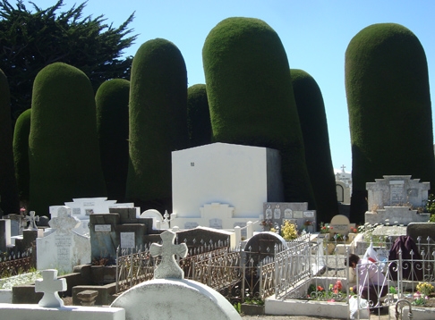
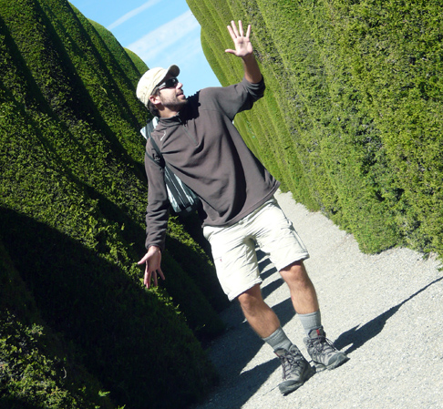
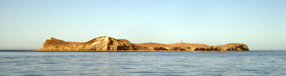
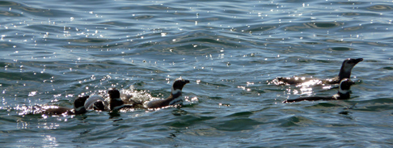
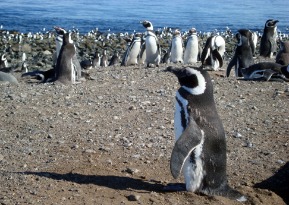
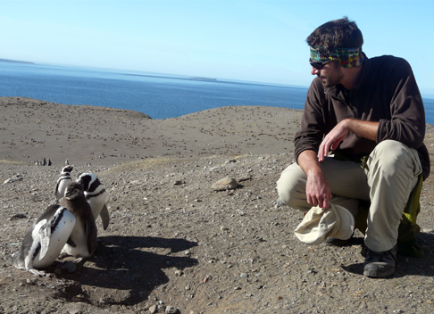

Hola hola,

Guido and I are getting closer to The End of The World. The LAN flight carried us from Santiago to Punta Arenas, the patagonian capital. As I wrote in the previous post, my beloved Julbo sunglasses were the unfortunate price to pay to some sneaky LAN crew member; here in southern Chile the solar radiations are among the strongest in the world, so buying a new pair was top-priority: does anyone remember the hole in the ozone layer? It was just above Antarctica and therefore here.

I bought new sunglasses in an outdoor shop where we also got a new tent: the one that Mauro & Anna had kindly lent us was definitely too light for the icy temperatures down here. In fact, despite being there during Summer, our only chance to take off the jacket was to stand in the full sunlight, and still we had to face the lethal wind, whose speed can reach up to 160 km/h.

Punta Arenas is a quiet town, very easy to get around as it's all built in a rigid squared blocks scheme - nothing to see with the uncontrolled development of Valparaiso's hills. We spent our first morning in Punta Arenas visiting the town's main attraction: a perky cemetery. Its most distinct characteristic are the trees, all shaped like Barbapapa. The funniest one was a purposedly-shaped, giant green willy. I won't show it here, though -- find it on my Facebook Page!

Despite it being a graveyard, the whole atmosphere was quite jovial. The perfect spot to improvise a dance among the Barbapapa. In this picture you will also see my shiny new sunglasses.

This post's usual "nature section" is very interesting: from Punta Arenas, we took a boat to visit Isla Magdaleana. Seen from far away, it looks like a big rock with a lighthouse on it:

As you approach though, the boat starts to get surrounded by small swimmers: the island is a massive penguin colony!

The big rock hosts some 100.000 penguins. (This is actually the average between the numbers we've heard, ranging from 60k to 140k). They really cover the entire thing, and I marveled at the fact that the ocean feeds them all. They sometimes reciprocate and "feed" the ocean, when hungry orcas feel like a black and white snack.

We had so much fun with them! They walk so clumsily that they look like toys. The emit some high pitch sounds and every now and then they gargle and sneeze! They are for sure the cutest animals on that rock. The competition isn't much anyway.

After reaching the lighthouse, it was time to go back to Punta Arenas. We stayed at a lovely [hostel / camping](http://www.chileaustral.com/independencia/) whose owner Eduardo is the kindest hostel manager you will ever find. He is uncommonly friendly and genuinely interested in your well being. In a few posts we'll pop back here during an unexpected adventure and you'll see what I'm talking about.

