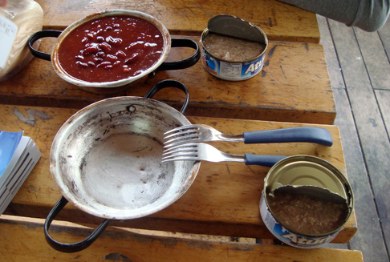
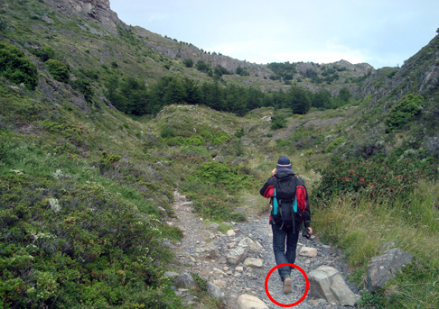

**Day THREE, the end**

During the third day, Guido and I walk the last 23 kilometers of the trail to reach to the bus stop. We could trek for one more day and complete the "W" circuit, but Guido's mountain boot is broken beyond any repair. We tried our best so far, holding it together with a big rubber band, but more gashes are appearing on the sides. 

Walking and camping for three days in the Torres del Paine National Park has been demanding but beautiful, a true immersion into a well preserved mountain environment. Today we are able to spot a lot more birds: they seem to feel more confident, or maybe they just want to reward our perseverance.

**Day TWO, the breakdown**

We are only at the half of the second day, but Guido's boot shows the first sign of strain. A small cut opens on one side. We wonder how long it can hold, but hey, we're optimist!

The views from today's walk are breathtaking, on sceneries that can only be seen in Patagonia, the closest point to icy Antarctica. 

Today's problem is the path itself. So rocky, and damn hard to walk on. At some point we miss one turn and get lost, and spend the next two hours making our own way through bushes and rocks prone to landslides, before having lunch in the shadow of a big boulder and heading back.

At night, the usual meal: tuna and beans. The two forks that we used were an important part of the meal. Two days earlier, we had bought all the food for four hiking and camping days, but only on the bus to go we had realized that we didn't have any cutlery. In Puerto Natales, a bus connection for the park, we had lunch in a miserable and smoky restaurant where we waited one hour for two sandwiches. An hazardous thing to put customers through, especially when they are in need of new silverware!

**Day ONE, the glacier**

Wow, we just arrived in Torres del Paine National Park! Four days of pure trekking and camping are ahead of us! To be honest, Guido's boots don't look like proper mountain boots at all, but he reassures me that they've behaved flawlessly when he trekked in Turkey. He seems indeed to master the path, albeit very rocky!

This is only the first day but we are rewarded with incredible sceneries! We reach Lake Grey, created by the meltdown of Glaciar Grey. The sky is gloomy and dark, the light is cold. Massive icebergs floats on the lake, and the strong wind whistles through the trees. Such an apocalyptic scenery feels like the end of the world.

A few walking hours later, we reach the viewpoint on the glacier itself (image below). It's gigantic, impressive. The geological layers are all exposed and very twisted, reminding us of past upheavals of tremendous destructive force. 
The comeback to the campsite is long, 11 more kilometers to test our legs. Ah, the Everest times seem so far! Luckily, some [Pisco Sour](http://eatwineblog.com/2009/07/17/pisco-sour-chile-and-perus-iconic-drink/) will cheer us up. Guido's boots seem to hold just fine.

