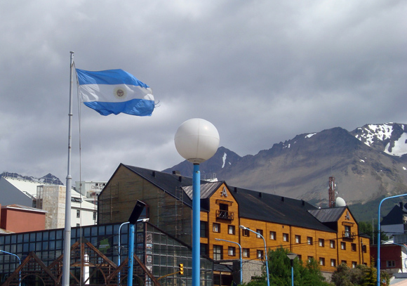
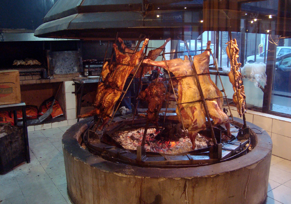
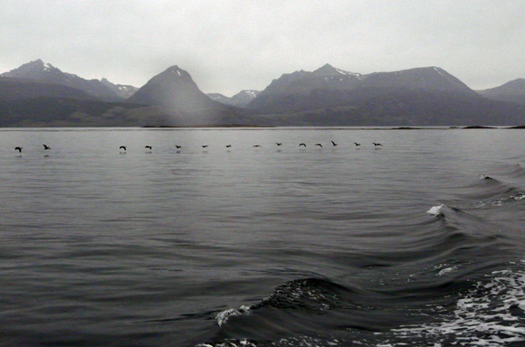
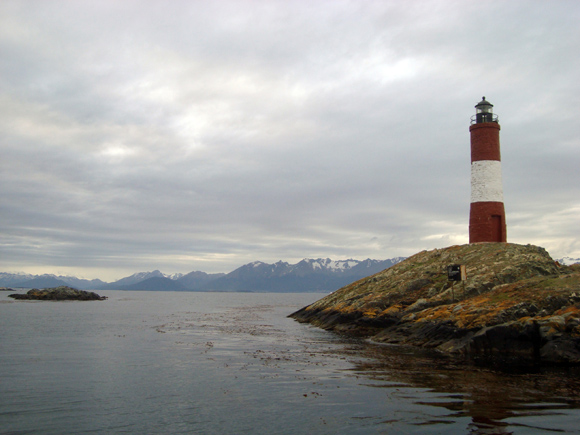

Hey people!

I have taken a short hiatus from writing, and used this time to improve the blog itself a bit. The last time we met, Guido and I were about to reach The End of the World.

Back from [Torres del Paine](http://ticofab.io/long/2011-02-15-torres_del_paine_through_the_boot_hole/), we spent one night at a campsite in Puerto Natales and the next morning we were back to Punta Arenas. From here, we decided to cross the border to Argengina, going ahead south until the road would end. That is how we reached Ushuaia. There are some settlements further south, but they are so small that they barely qualifies as villages. With a population of nearly 100.000, Ushuaia deservedly qualifies as the southernmost city in the world. Windswept, blueswept (Argentinians can't contain their love for the national color), cold and gloomy. _La Fin del Mundo_, as they call it.

On the (long) way there we met a funny duo, Gitty and Linda. While Guido and I didn't have any arrangment for the night, the two already had something booked. We went thus on the usual accomodation quest, and we agreed to meet them for dinner at their hostel. We were lucky enough to find two beds in the cheaper place in the surroundings, but upon retourning to theirs we noticed that things were not going as smoothly for them. Appaerently, their hostel was really bad: small, dirty and expensive. We told them about ours and they decided to switch... but they had made bricks without straw.
The owners of their place turned out to be the nastiest one ever. They didn't want to let them go unless they had paid for the four nights they had booked! Initially they were just rude (they kicked Guido and me out in the cold, to start with), but at some point they shut the door and refused, the owner girl stood in front of the door blocking the exit, screaming "fuck you" to her own customers! 
Gitty promptly threatened to call the police, and after some more screaming they were let go. I have never seen such a situation. This horrible thing happened at a place called Cruz del Sur (they don't even deserve the link). Please avoid it should you go there - unless you are eager to receive a genuine Argentinian middle finger.

After that we spent some time together to find a place for them. Our hostel had no more space, and it was getting dark. Fortunately, we entered a somewhat expensive hotel to ask for help and the dude called straight away other cheap hostels in town till he found one with two beds available.

We were finally set for dinner, and that very night we discovered something we'd quickly become fond of: the Argentinian 'all you can eat' buffet, called "Tenedor Libre" (free fork). Beside the usual stuff, the main attraction here is the barbecue. A massive fire in the middle of the room, with entire animals on it! Although I have some vegetarian tendencies, meat was mandatory and oh, did we fulfil our duties. This burning area is shielded by a glass, you must approach the window and ask the cook what you want. He will chop the meat with two heavy cleavers, his blows to be heard blocks away! Such a place is an absolute must-go if you travel to Argentina.

The next day we went on a boat to explore Ushuaia's stretched bay. We were not so far from Cape Horn. The wind was sharp and the sceneries were once again sublime to the extreme.

Particularty scenic was the 'lighthouse at the end of the world'. It's actually a replica of the original, but I guess the feel must be the same. Once upon a time, the Panama Canal was just a dream, and ships had to circumnavigate the entire continent. One imagines what such a lighthouse must have meant to sailors arriving from the European coasts. A light to tell them that an outpost was near, that they had survived the most perilous tract. And I guess that the sky that you can see in the picture must have been the best one they could hope for.

