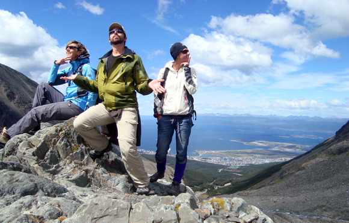
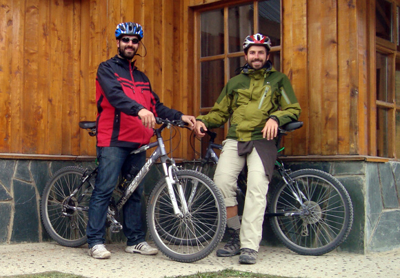
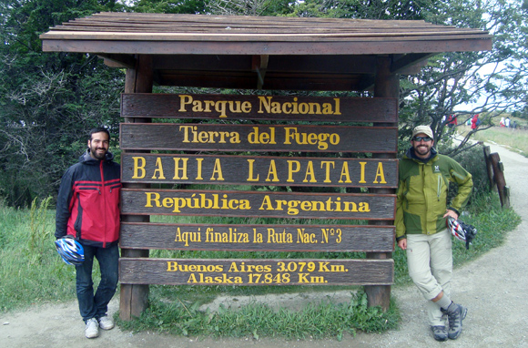
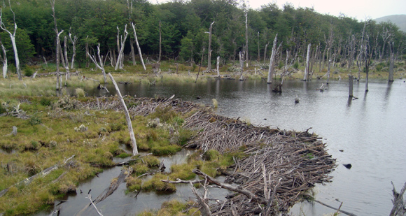

The last days in Ushuaia, Argentina, were spent in outdoor activities and a few "in-pub" nights. During the last day we also found out the most peculiar story about nature down here. That is, the devastating effects of... a few peaceful beavers. But, first things first.

Even though the second day was strangely sunny, Guido had to stay in and work on his laptop, so I hiked to the to local glacier with the two Dutch & Austrian travel mates I talked about in the previous post. The day was bizarrely sunny, and the hike was short but very steep. The glacier itself wasn't anything spectacular (not after the one we had seen in [Torres del Paine](http://ticofab.io/long/2011-02-15-torres_del_paine_through_the_boot_hole/)), but the true reward was an outstanding view on Ushuaia and its bay. 

On the descent back to town, we had a funny little off-piste adventure. Despite my grumbles, we agreed on walking all the way back. We began taking shortcuts through the hairpin bends, which worked out great until that very one. Our shortcut never made it back to the road. We kept following a sort of path through the trees, beautiful indeed but which made us land in a private property, an area full of junk with nobody but dogs barking at us! We trotted down the hillside and soon barbed wire blocked our way to the adjacent property. We sneaked through, only to walk a few more steps and meet the actual owners! We began to explain our situation but they were already smiling and pointing us to the right way to town. I suspect we were not the first ones landing in their backyard.

That night we enjoyed more Tenedor Libre stuff and drank in some local pub. The next day, Guido and I decided that our mission was to explore the Tierra del Fuego National Park. But we would do it differently this time... by bike!

We spent the entire day pedaling, and I kid you not, I realized for the first time in my life what gears are there for. That day we cycled some 50 kilometers of ups and downs, which left our bodies pretty darn sore at night. It's kinda shameful to say, but I never really went up steep hills with my bike. You all know that I live in the Netherlands, do you?
To get to the park, we cycled on the last 12 km of the renowned Route 3 which goes from Alaska to, well, here. I believe that 12 kilometers out of 17.848 are still worth showing off.

The park was beautiful as expected and treated us with the usual majestic sceneries. This one was just a few hundred meters away from the sign in the pic above.

The most peculiar thing that we learned that day was the tremendous impact that 50 beavers can have on a whole ecosystem. They were introduced here from Canada in the 40ies with a view to generate a fur industry. Unfortunately, fur went soon out of fashion and the rodents prodigiously multiplied to the staggering amount of 100.000 (some say 250.000) due to the absence of predators. They literally stormed the environment, destroying thousands of acres of trees and modifying the water network so heavily that the original wildlife is seriously endangered. Differently than the Northern American trees, these ones don't grow back from their roots, leaving a land of dead stumps. Here's an image, I had never seen a beaver-made dyke and I have to say it's impressive.

So even shy, cute, ingenious herbivores can be a huge problem. You can trust no-one these days. To face the ever expanding menace, the largest [eradication plan in history](http://www.nature.com/news/2008/080618/full/453968a.html) has been planned. I feel Hitler's one might have been a tad worse, but never mind.
