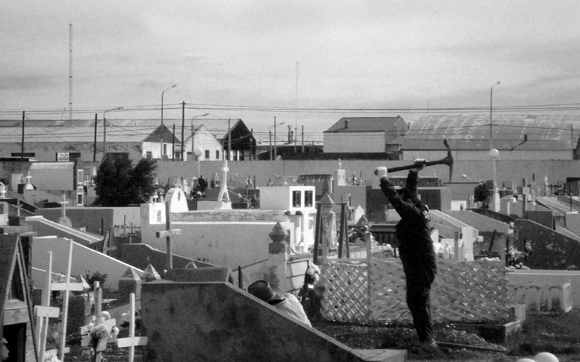
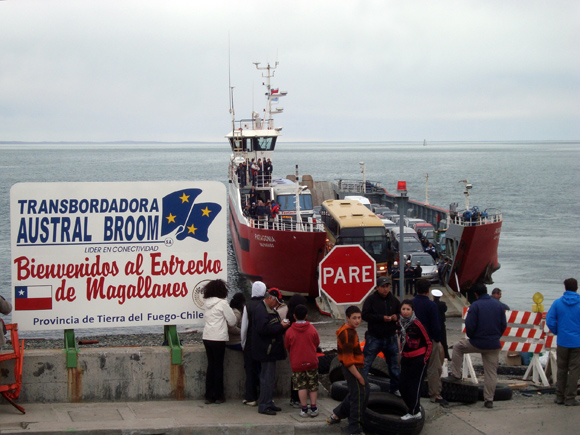
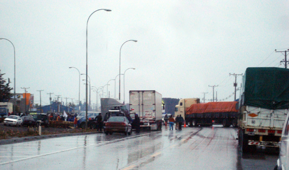
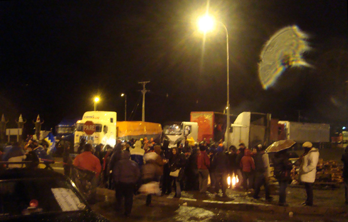
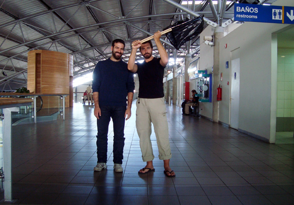

_This is the story of our journey back from Ushuaia, Argentina, to Punta Arenas, Chile. We didn't know that the Chilean Patagonia was prey of a massive strike against the government proposal of rising the gas price of 17%. Getting to the airport turned out to be A LOT more complicated than we expected._

**6 AM, departure**

We're lucky, the bus stop in Ushuaia is just one block away from our hostel! Departure set at 6:00, the driver has forgotten his sunglasses and the rising sun goes straight into his eyes, so I decide to lend him my sunglasses. I'm going to sleep anyway.

**7:30 AM, 1 hour since departure**

Breakfast break. The pastries are good, the coffee is awful, the driver struts around with my sunglasses, which makes me afraid he likes them a bit too much. The break is too short.

**10:00 AM, 4 hours since departure**

We arrive in Rio Grande, where we have to wait a few hours for the connection. The bus station is pretty lame, so we take a walk through the nearby cemetery. It isn't a rich one: coffins are exposed (yes) and holes are dug the old way. 

**2 PM, 8 hours since departure**

Border stop. There is a long line which precedes unusually tedious baggage inspection and passport controls procedures. While there, a lady on the bus informs about the massive strike at the other side of the border. Some flights seem to be canceled, and that begins to worry us: we need to fly the next morning, because then Guido needs to fly to Lima, Madrid and Rome. Any trouble would break the entire chain!

**4:30 PM, 10 hours since departure**

We reach the Strait of Magellan. Or better, the massive line of cars, trucks and buses that precedes it. Protesters have taken control of the bank, and don't let ferries unload their metallic passengers--we don't know how long we're gonna stay here! I call Mauro, Lesly and Paulina, everyone is saying different things!

**7:30 PM, 13 hours since departure**

People are hungry, angry and scared. The protesters finally let us on the ferry. We rejoice as our journey continues but uncertainty still reigns.

**10:00 PM, 16 hours since departure**

Another massive blockade stops us some 10 km out of Punta Arenas! Trucks block the highway, the sun is beginning to set and it pours down. There is only one solution: get our stuff and begin to walk to the city center. 

**10:30 PM, 16 hours since departure**

We get a ride to the hostel. We spend there a bit of time, just enough to dry out a bit. We check the LAN website and flights for the next morning seem to be confirmed. Our only option is to try to reach the airport right away. We don't know how long it might take--quite some hours if we have to walk all 25 km. We tell our situation to Eduardo, the incredible owner of that place, and he creates a black flag for us, which is the color of the strike. This way, he explains, people in strike will reckon you are on their same side.

**11:30 PM, 17 hours since departure**

We leave the hostel, it's dark and it's pouring down. Huge puddles have formed on the road. We catch a ride to the first blockade on the way to the airport, pass it walking and catch another ride to the second. This guy also gives us two sandwiches and some yoghurt, we're quite hungry at this point! We reach the second blockade. There are many people despite the cold and the rain. Singing, fire and wine keep their morale high. We talk to them about the reason behind the strike, and learn more about Patagonia that we ever did before.

**1:00 AM, 19 hours since departure**

After some more walking and two more rides, we arrive at the airport. Quite some other people are in the same boat. We're exhausted but the adrenaline is still high and keeps us awake for one more hour. The next morning a local TV interviews me on our odyssey. Our flight is confirmed. It's time to wave our flag one last time.

