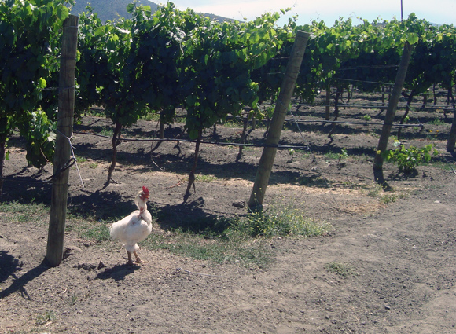

After the adventourous comeback to Santiago, Guido and I spent the night at Paulina's. We cooked dinner for her and slept so well that we arrived at the airport 10 minutes before the check-in closing time. That same afternoon I took a bus back to my Valparaiso.
I had already a few activities scheduled there for the following days. The one I am going to talk about today was for sure the newest one for me. A winery tour! 

As you might remember from my (very successful) post [Los Porteños de Valparaiso](http://ticofab.io/long/2010-12-23-los-portenos-de-valparaiso/), one of my friends there happens to be a passionate winery tour guide--the opportunity was not to be missed. Together with Wendy and Dave, two friends met on the Torres del Paine hike, on one sunny afternoon we reached the Emiliana vineyard. This the first beautiful sight of it from the highway.

What makes this vineyard very special is its official status of first biological winery in Chile! It was born as a spin-off from Concha y Toro, the largest Chilean wine producer ("Casillero del Diablo", anyone?), as things would have probably been impossible without the financial support of the "mother business". 

The tour revealed us many very interesting insights. Working withouth pesticides and such, every "menace" is countermeasured with natural weapons. The funniest one? In order to eat some kind of mites, the vineyards are full of trotting chickens!

Beyond bio: they also apply part of the [Biodynamic](http://en.wikipedia.org/wiki/Biodynamic_wine) discipline, inclunding calculations on the moon phases: if it has an effect on ocean tides, it should also have an effect on soil water, so that the plants are more irrigated when our celestial body is at its fattest.
The compost is very natural as well: appaerently, Alpacas provide the best fertilizer around. Appaerently, it's also a lot of it.

The best part is naturally at the end. The visitor center is mainly crafted out of wood, a very quiet and cozy place. My friend Josué was there waiting for us: we sat down at the bar and began tasting fantastic wines, one after another. First white ones, then the reds. It all was matched by some crusty bread, to be dipped in the tasty olive oil that they themselves produce. 

I am obviouly not a wine expert, but I really enjoyed the tasting. Very lively, maybe because it was the last tour of the day and Josué allowed himself to bend the elbow a bit more!

I also liked very much a sort of "ethical" attitude of this winery towards their employees. Work at a winery isn't even the entire year round; the big chunk of work concentrated around grape harvest times. In order to help the workers outside such periods, each of them is given a patch of land to grow his own stuff.

I really enjoyed the wine tour--and got back to Valpo quite tipsy. For a more accurate description of the wines and their tastes, check out this [wine blog's article](http://justanotherwineblog.blogspot.com/2010/12/emiliana.html), written not long before I went there and more focused of the wine itself. 

