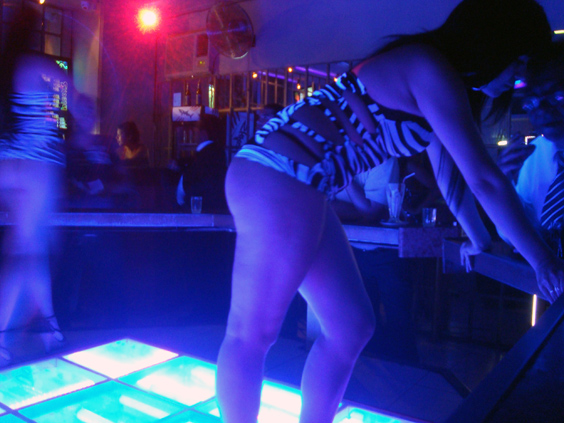

My Chilean time is coming to an end. In a few more days I will leave this amazing country, of which I have seen nothing but a glimpse.

During my last days in Santiago I followed the suggestion of my friend Kindo and went to a _Café con Piernas_, literally "Café with Legs". These Chilean bars are venues where everything revolves around one thing: the waitresses' legs. After hearing many things about it and reading a <a href="">[couple](http://www.thecuriousenglishman.com/2011/07/cafe-con-piernas-chilean-cultural.html)</a> <a href="">[more](http://www.southamerica.cl/Chile/Cafe_Con_Piernas.htm)</a>, I decided that I wanted to check it out. So I involved Paulina, a Chilean friend: she had never been there herself and found the idea exciting, so we met one afternoon and went for it. We struggled a bit to find the one we were looking for, but finally made our triumphant entrance in the "Blacks II".

The place was quite small and almost entirely occupied by the horseshoe shaped bar. The girls serving drinks had their legs completely exposed, and the rest part of the body wasn't very hidden either. Most of the light in the room came from the the floor behind the bar. A blue, dim light, whose only purpose was to highlight the _piernas_.

We were welcomed by one of the waitresses, we'll call her Claudia (see picture above), who greeted us with kisses on the cheeks. Which is a normal greeting in Chile, but only between friends--and especially not in professional contexts like waiter-customer.

Being Paulina and I some kind of unusual customers, it was no surprise that Claudia was more than happy to have a chat with us, youngsters of about her age and not thirsty men in their after-work hours. We had a very pleasent chat which was also the opportunity for a sort of interview.

**So, how old are you and how long have you been working here?**

I'm 25 and I've been here for two months.

**And this bar, when did this open?**

Oh, more than ten years ago!

**What's the typical clientele?**

Well, I would say mostly men in their fourties of fifties. On Saturday nights there is a deejay, and that attracts a somewhat younger crowd.

**Are there any women coming in?**

Oh yeah, more than you would imagine! Most of them are actually translators for the tourists!

**And say, can one take pictures of you girls?**

Sure--given that I see the 1000 pesos tip, baby!

**Alright... do you let everybody take pictures of you?**

No, only people that are _buena onda_. ["Buena onda" roughly translates to "good vibe", ndr]

**I see. Have you ever been harassed by customers?**

Yes, quite a few times already. There is often someone that gets kicked out.

**Do you know if there are actual prostitutes here?**

Mmmmm... not that I know, but I wouldn't put my hand on fire about this.

---

As we parted, she invited us to meet her at her favourite bar later that week, but I didn't have enough Chilean time left.
