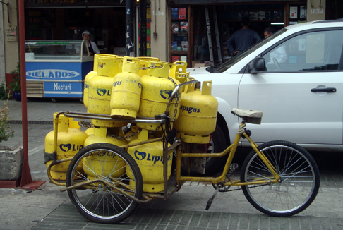
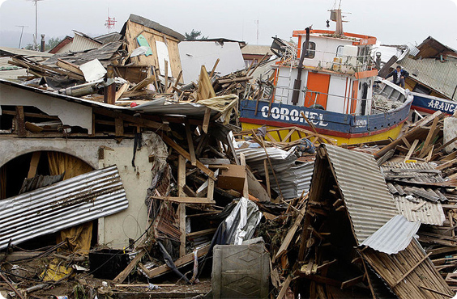
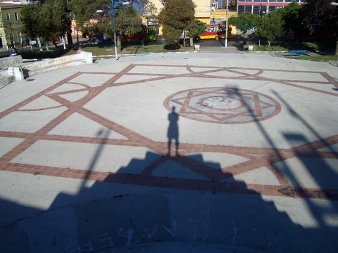

Hola amigos, I thought I'd create a post to write a few more remarks about my experience in Chile that didn't find room in the previous entries.

* Toilets have low sinks. Actually a lot of furniture is quite low--chairs, tables and kitchens alike.
* Most apartments use still a gas bottle for the heater. The way to get a new one is very funny: you order a gas bottle on a shiny modern web-site, and a few hours later it gets delivered like this!

* Chile is much more similar to Italy than the Netherlands is. Everybody I told this to replied with somethimg like "Obviously!" or "Of course", but I'd never expected it to be so true. My latin roots awakened while there. I was almost afraid I didn't have any, now I know that they were just numbed. In Chile, I found the same southern-European attitude towards sharing and togetherness---the same value given to doing stuff together. It breaks my heart to reckon that in two months of Chile I had more Chilean friends that Dutch friends after 4 years in Amsterdam.
* I felt so relexad in Valparaiso, and I think even my immune system performed better. For instance, one night I had an annoying sore throat, with subsequent snotty nose and headache. Normally, that would have been the prelude to a few days of fever, so I was already quite resigned. Instead, the next day I felt a lot better and the third day it was completely gone.
* Every Chilean person in the central region, and I mean EVERY ONE, has his story about the earthquake that hit the country in February 2010.
    
    * Lesly was sleeping at a friend's house. They rushed out in the main square nearby and everybody was crying in terror.
    * Daniel was alone at home. His family was in La Ligua, where his father-in-law was protecting the cradle of his baby with his body. He hadn't noticed that the mother had already taken the baby out with her.
    * Anita, the youngest of 29 brothers, was holding her daughter in her arms, reassuring her that it would be alright.
    

* On my last Chilean day I had lunch with Paulina--a different Paulina, not the one I went to the _Café con Piernas_ with. I don't know why, but while savouring my last Churrasco sandwich I realized that my comeback to Europe was approaching. I felt so bad I almost broke into tears. Chile felt like home.

