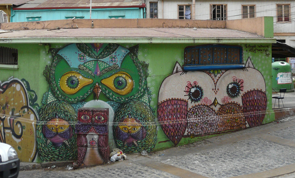
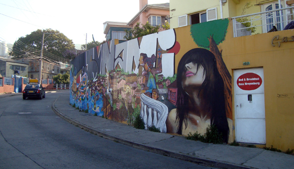
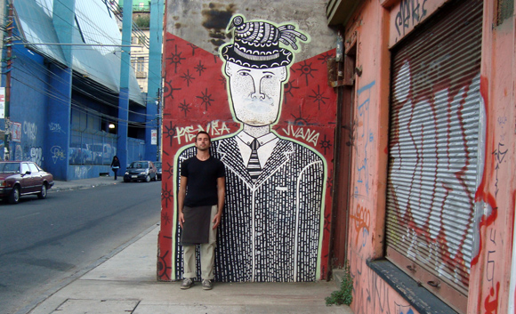
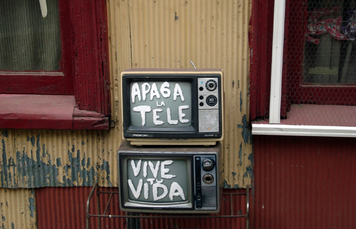
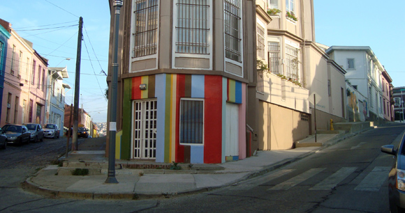
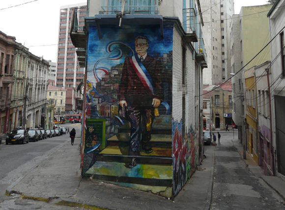

With this post I am beginning a trilogy on Valparaiso. I want to give focus to three very important charachteristics of this unique place. The first one I'll look at are its walls. Please comment and link other resources on the topic, if you have any!

In one of my first writings about this city, I mentioned his student soul. That is probably the main reason behind the fact that everywhere is color and graffiti art. 

You won't see many messy, improvised patchworks. Most of the walls display well-thought compositions which probably required a lot of work. 

Some of them even have interesting stories behind. The guy I'm standing next to in the next picture is actually a representation of Jesus. Valparaiso has a local myth, called "Cristo de la Matriz", name borrowed from the church nearby. The legend says that he used to look up, towards his father up in the sky, but was forced to gradually look down by the sins happening in the adjacent harbor neighborhood, the Barrio Chino. Only seven days before the Judgement Day he'll raise his look again, to warn people that there's little time left to repent.

There are not only graffiti--otherwise this blog entry would have another name. It's all about the way people here treat their facades as creatively as they can.
This is the most brilliant example I could find. 'Apaga la tele, vive tu vida' means "Switch off the TV, live your life". I have seen this image as Facebook profiles, read its message in countless posts, statuses and photo album names. Strikingly effective, this composition disappeared shortly before I left.

Another one I liked a lot was this corner in Cerro Alegre, halfway between a rainbow and a barcode.

Of course, Valparaiso's walls also host political expression. Especially, the iconic Allende can be seen at quite a few spots here and there.

I wondered what could be the reasons that lead to this "walls movement". It must be a cocktail of reasons. Surely the young student population, but also the presence of a general artistic spirit, which must have spread as a cascade effect. Unfortunately, I couldn't discard the idea that much of this creativity on walls was started to cover their cracks.
