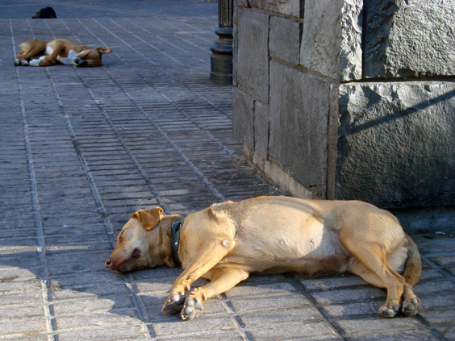
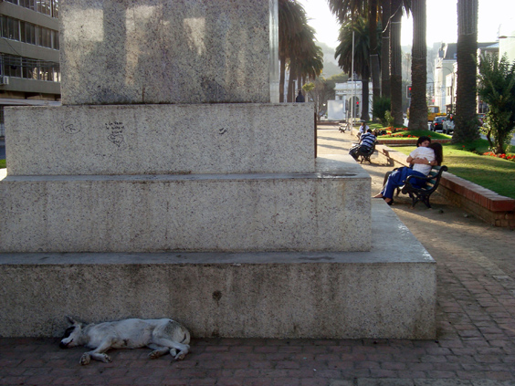
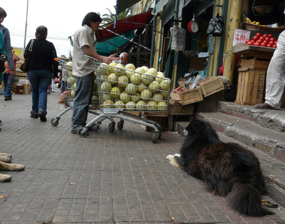
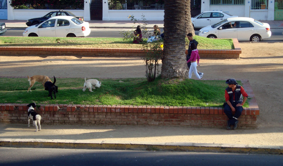
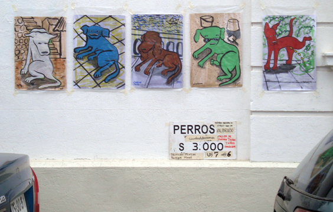

Welcome to the second instalment of the Valparaiso Trilogy! There are a zillion dogs in Valparaiso. They have no official owner, but the adjective "stray" doesn't fully belong here either, as one entity cares for them: the entire community. People love dogs and take care of their basic needs. Restaurants feed them with their leftovers, private citizens occasionally take them home for a good brush.

Dogs can be found everywhere, mostly busy in their peaceful sleep; they don't seem to be a danger for anybody. They don't pay much attention to the people around and the feeling is definitely mutual.

They generally prefer the sun, but they opt for the shadow when the wind stops blowing.

You will even see them around the the last place you'd allow them to be: the food market. But then again, most of them look acceptably clean and healthy.

Their lifestyle seems quite lonesome, but sometimes they play around together.

You might at this point wonder why the city hasn't taken action against all this. I personally don't know. I believe that the majority of people like and do care about them, but I have definitely heard strong complaining. Shop owners must be a bit pissed off by these doorstep sunbathers. The streets are covered in poop and suspicious stains are on almost every wall, which heavily affects the town's general smell. Some of the dogs might be carrier of diseases, and a few of them barks at cars, which is loud and annoying. Plus when walking home at night the dogs look a lot less friendly than during the day. I once happened to find one sleeping on the building's doorstep and was quite intimidated. Fortuntately he simply woke up and gently walked away.

For good or bad, the four-legged population of Valparaiso is one of the city's distinctive traits. They are such an institution that some kind of dog art pop out occasionally along the streets of the hills hoods.

Around the web you'll find a lot of other [colorful](http://breadandtorah.blogspot.com/2008/05/dog-blog-and-cat-chat.html) and [funny](http://www.theworldeffect.com/my-entry-1-2) posts!

