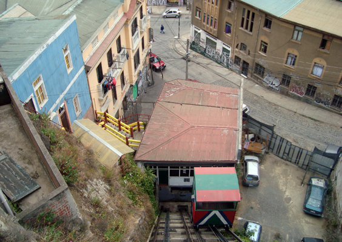
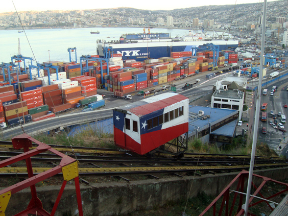
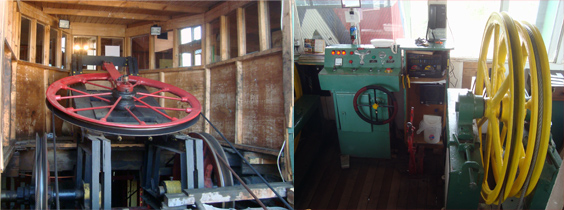
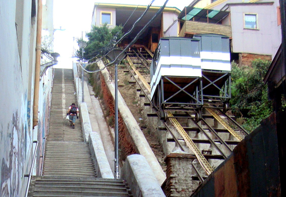
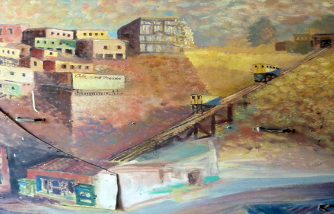

Here we are: the last chapter of the Valparaiso trilogy. The topic will be... (drumroll) ... its Elevators!

Built long time ago to help the lazy rich climb up the hills, they still take you all the way up for an insignificant price. Some of them do it almost vertically! This is the view from the elevator that used to take me to my friend Mauro's bakery shop & house.

"Elevator" isn't actually the right word to use: it should be cableway, but everyone calls them _Ascensores_, which is Spanish for elevator.
From very early in the morning to quite late at night, these lovely metallic boxes rattle up and down their tracks. Their inherent jerkiness and the noise they produce as they clamber up will make you wonder how many bolts they loose at each round.

They come in different sizes and outfits. My favourite one would probably be the _Ascensor Artilleria_, which is dressed in the Chilean flag and offers an outstanding view on the harbor and on the entire bay. The elevator itself oddly resonates with the containers that sit by the dock, which I am sure are envious of their more dynamic cousin.

They are pulled up by century-old, massive iron wheels situated at the top end of the rails, which can be placed horizontally or vertically. Next to them sit usually an employee, whose actual task is quite mysterious as tickets are often handed out only at the bottom. Days must be pretty boring for the upstairs guy.

I know what you're thinking. We've all seen and lived in hilly cities (except my Dutch friends, maybe), and we've always stoically walked up and down. I had the same skeptic attitude in the beginning. But, trust me, you've always walked up and down because you didn't have an elevator available. After two months there, I would arrange all my routes to be able to catch one instead of crawling up the inclines. This one is one of the most famous, _Ascensor Conception_.

As we've seen in the canine and the mural chapters of the trilogy, any of Valpo's icons will give spark to art. Elevators are no exception to that--this town seems to me one of the most self-celebrative art cradles I have ever seen. Deservedly so.

