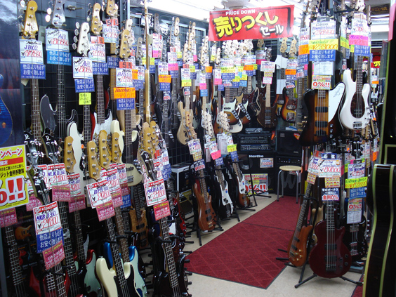

Tokyo has one of the highest population density in the world. The same holds for guitars. Those in this tiny shop in the "guitar shops neighborhood" were so crammed that in some areas you could only see the headstocks. I'm sure there must be a law regulating the inter-guitar space, otherwise the owner would have compressed them even more.