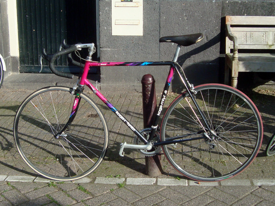
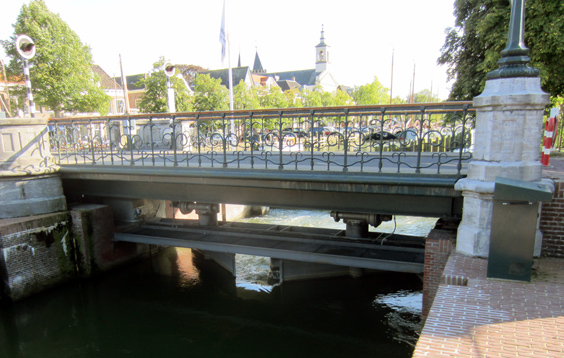

Everyday life is different than perpetual traveling, and in many ways it's better. One of the undisputable advantages, to be further discussed in a future post, is that it makes it way easier to cultivate a passion. How could a nomadic lifestyle allow learning to play piano? Don't get me wrong--I'm sure it's achievable to learn piano while traveling. It would just be orders of magnitude more complicated.

One of the passions that caught me upon returning to Amsterdam was the bike. I began using the racing bike of my then housemate, Etienne, for longer and faster rides out of town. Here's the beast: a fabulous Koga Miyata steel bike, with two down tube friction shifters.

This was the first time I went alone down the road, somewhere I'd never been before, and I can't forget the thrill I had upon reaching Muiden, a little lovely town some 15 km out of Amsterdam, welcomed by a blissful sun. I was only a handful of kilomters away but it felt like I had gone as far as Patagonia again. 

There are a lot of things to discover in Muiden, and we'll come back here many times. That day, the peak was when I saw a sluice gate in action for the first time. The water is overflowing from one side to the other, I had to call John to share my excitement. Stay tuned 'cause a lot more will come.

