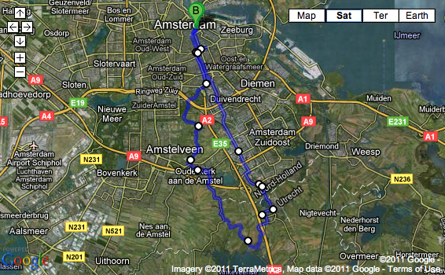
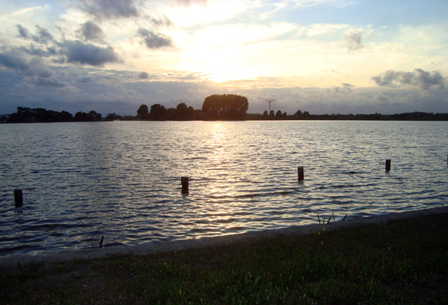

The sweet flavor of discovery. Once tasted, it's hard to get rid of it. Ask Mr. Truman if you don't believe me. The goal of the next bike ride was Abcoude, a little Dutch town just at the border of the Utrecht province. I didn't choose the way to get there, but rather followed my orientation and the signs. Which was fine, but took me through an area whose reputation is quite awful: Amsterdam South-East, or _de Bijlmer_.

From the point of view of Discovery, going through an urban area, as grey and industrial as it can be, doesn't really matter: what is really important is to cover new ground, to see new areas, to feel like you're the one touching that soil for the very first time.

What fills me with excitement is also to learn what sits in between things. I'll cover this in a future topic. The nicest thing I discovered during this ride, is the cute lake next to Abcoude, which I admired during one of the famous 360-degrees suggestive Dutch sunsets.

