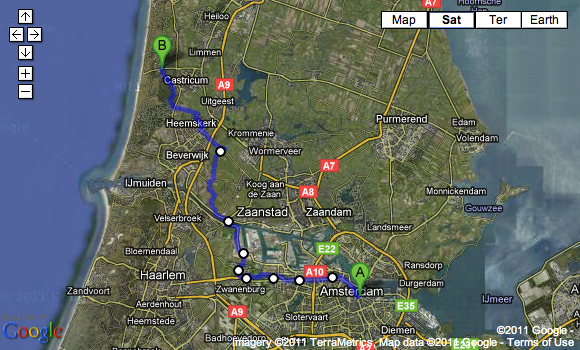
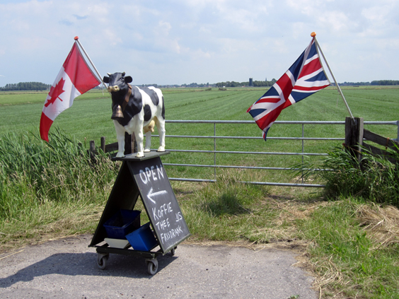
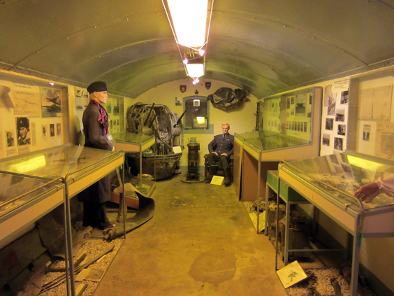

Most of my rides will be a circle from and to Amsterdam, but not all of them. Sometimes it feels good to ride out without [having to spare energies for the comeback](http://www.youtube.com/watch?v=rs6TN1j1weI&feature=related). Riding one-way brings in some differencies: first and foremost, you can stretch further out. 

Secondly, there is an ephemeral feelings to it: you are riding on a way that you won't have the chance to ride back. Of course you can always go back there sometime in the future, but, in reality, chances to do it again soon are fairly small. Such a feelings puts some kind of positive pressure on the enjoyment you're getting from the ride. Make the most out of it, because you're not likely to do this again very soon. 

Today's ride was absolutely fantastic, under a great sun and it even involved a ferry lift! The most unexpected little discovery was a bunker from the Second World War that has been transformed into an Air War Museum (and Café, just not to break the rules). The little composition in display outside has to be the cutest of its kind.

Inside, you'll find a lot of relics and stories from war times. From the plane crew that survived five days in the open sea after a crash, to the well-preserved plane cockpit complete of all machineguns. This little bunker was just another one of the infinte gems that this country will let you discover only by bike.

