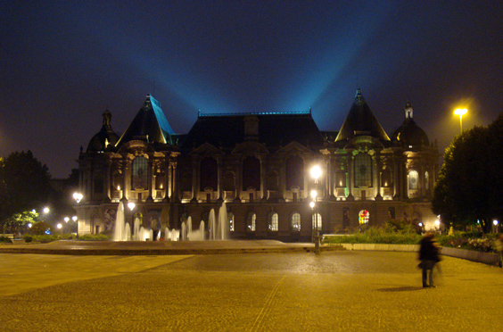

Lille is the capital of Northern France and the country's fourth biggest town. The main central square, _Place de la Republique_, is dominated by the Palace of Fine Arts. I never manged to get in there, maybe because at nights it looks like a haunted manor.