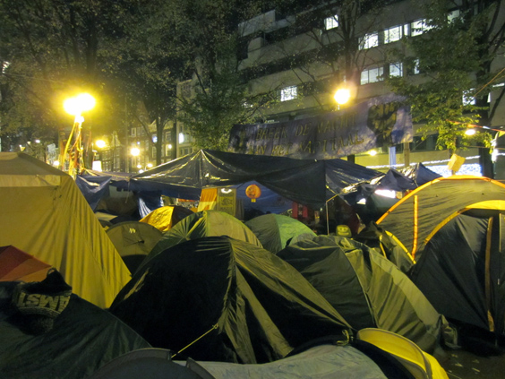
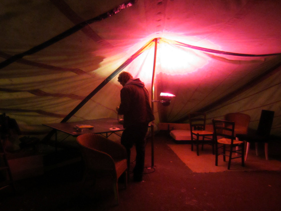
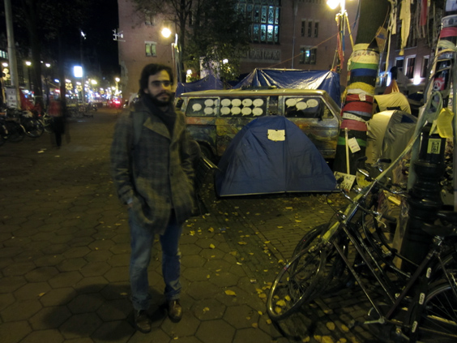
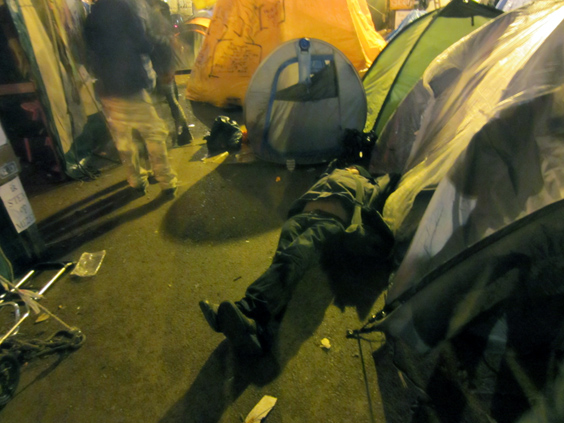

As a big, attractive, famous & infamous European capital city, Amsterdam was a top place for the "Occupy" movement. All things considered, 99% is almost 100% and it is safe to think that some of that is here as well. The chosen spot is the Beurs van Berlage, along the most turistically exposed street in town-the Damrak, which connects Central Station to Dam Square. Tents have sprung up two weeks ago and, against all _cold_ odds, are still there. As I write, the plan is to move the camp to the big Museumplain, the green patch next to the Van Gogh museum.

I visited the camp two nights ago. I talked to the people there (the most important one at the end) and, of course, took a few pictures. Read on to find out what I learned.

First, a round of exploration: sleeping tents make the central core of the camp, while bigger tents around create important facilities such as a pharmacy (heavily guarded), a clothing storage and food/cooking facilities. One of the most important side structures is the assembly barrack: furnished with a few improvised couches, tables and chairs. Here it's where meetings take place among the occupants--or actually anybody who fancies going. 

I have spoken to a few people there. The first attempts were not very successful: a guy sitting there with a joint speaking a previously unheard language whose dialogue obviously wasn't based on mutual interaction, or an Australian girl digging for pants in the clothing room. The most unusual was a guy who confessed his understanding of Gaddafi as a man, who agreed with me that he shouldn't have killed that way, and that at the same time "thousands of people are killed like that every year in the Netherlands but nobody knows". Errr, ok.

I was a bit discouraged in my intent of learning more about the movement, when I stumbled upon the guy who made my night. A Spanish guy, let's call him Alex, who I met once at a friend's place. We had a good connection at that (tipsy) time, so I ran after him and started talking to him. I asked him what his role there was, what the goals of the entire thing are and what are the procedures to get there. He was really insightful. I have to thank him again in this post as the poor dude was going home but ended up staying one more hour!

To my understanding, the ultimate goals of the protest are a more transparent management of the public thing and a fairer financial regulation to achieve a better wealth redistribution and limit underground speculation. We discussed quite a while about these and other goals, and I very much agreed to some of them, at least in principle. What saw us diverging is the way to spread these ideas and reach these goals. He explained me how the population of this protest vary from the mild reformist to the squat-like, "fuck-the-system" people, plus everything in the middle. He's nobly trying to tie all these souls together, discuss and involve everyone. 

I explained to him that this whole "occupy" thing is all in all just _marketing_, whereas his ideas are the real content. 'Marketing' is the mean that one chooses to bring his content out there and make it visible to other people. I am not sure that this specific way of marketing their ideas is the best one over all, and mentioned instead the [Five Stars Movement](http://en.wikipedia.org/wiki/Five_Star_Movement) in Italy, who has grown a lot since 2005, through little but well-aimed actions, without receiving any media attention. Media and people's focus towards the "Occupy" movement will be inevitably distracted by all the stoners and drunkars in there, and it will be certainly interpreted as a temporary relocation of the squats crowd and habitual activities in the streets, which is honestly also the impression that I had.

There would be many more things to be said. I'm not sure what this protest will lead to, at least in Europe. But even when nothing would come out, I think that it's _extremely_ healthy for our society that such dissent exist and that people are allowed to express it in such a peculiar way. Everyone choose the marketing that best fits his view, so here's to them.

