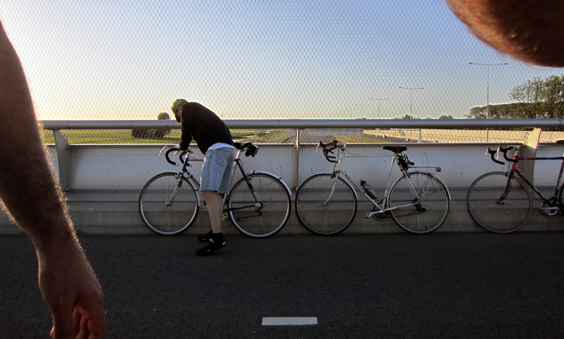
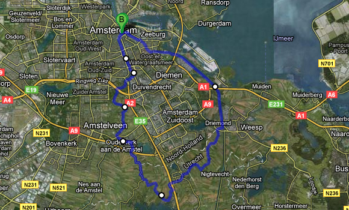

Most bike rides will be ridden among nature. Getting away from the city buildings is one of the main purposes. During this amazing bike ride with two friends, we happened to cross the highway on an elevated bridge. We had a short contemplative break from its top, during which I took this picture, and we all felt lucky for being up there with our bikes rather than in the busy road below.

That ride was special in the respect of riding together with two mates. It takes already a lot of work to put together two people, let alone three! We rode all the way down to Driemond along the massive canal, alwasy full of commercial ships, and then along a quiet canal all the way to Abcoude. A lot nicer to get there this way than through the city like in my previous ride there. A windy road through the fields brought us back north to Ouderkerk, and the final ride along the Amstel river makes for a triumphant re-entrance in town.

