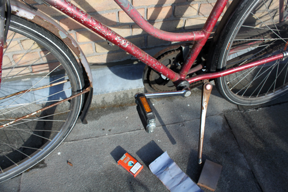
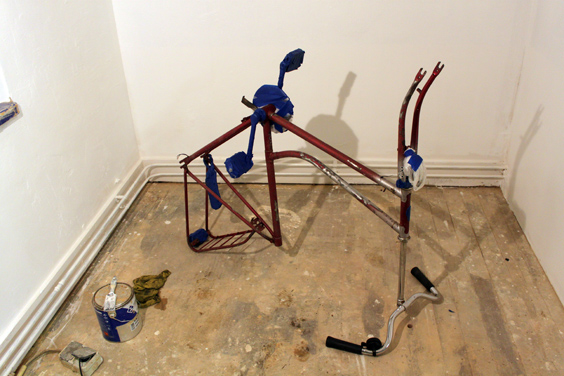
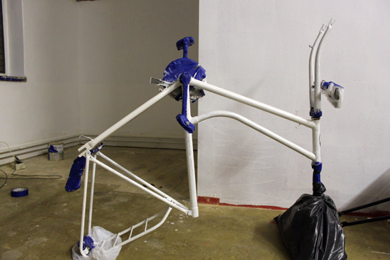
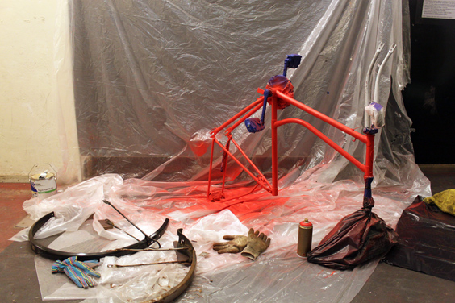
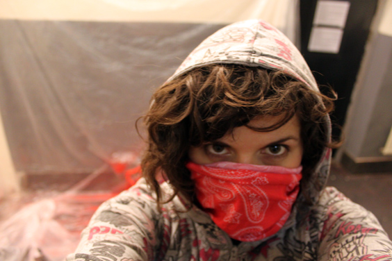
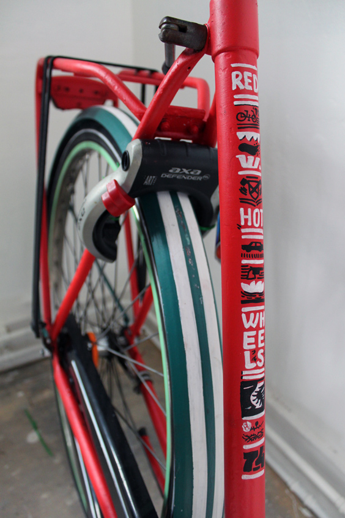

I appeared on the November issue of Amsterdam Magazine, a 50.000 copies, English-speaking monthly!

Have you ever heard of MTV's program "Pimp my Car"? If so, you'll know what I'm going to talk about: my beloved city bike has been fully pimped! Here's the link to the [full article](http://issuu.com/amsterdam-magazine/docs/amsterdam-magazine-november-2011), at page 53!

In this regular column, the Magazine takes care of Amsterdam's most beloved bycicles, giving them a full clean-up and an aesthetic boost, in collaboration with selected visual artist. I chose "flamboyant red muscle cars of the 70's" as theme. My bike ended up in the hands of Jovana, who fashioned her up like no-one before. Also, all the pictures in this article appear thanks to her courtesy.

Here's a detail of how challenging the task was:

And here's the pictures of the entire procedure!

...which required some safety measures against the red spray...

...until the amazing final touch, this amazing graffiti.

For a picture of the complete bike, read the full story [here](http://issuu.com/amsterdam-magazine/docs/amsterdam-magazine-november-2011) (page 53). 

I have the most beautiful bike in town now!