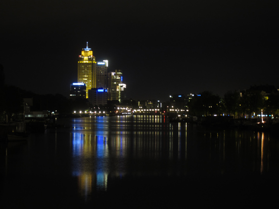

Rembrandt is the undisputed Master of Dutch Golden Age of paintings. His _Nachwacht_ ("The Nightwatch") is the most precious piece of Amsterdam's most important art museum of that period, the [Rijksmuseum](http://www.rijksmuseum.nl/). The 21st Century tribute to the guy is a tower. The tallest you see in the picture. Right on the Amstel River, with an eternal blinking light on top, which I see straight from my bed at night.