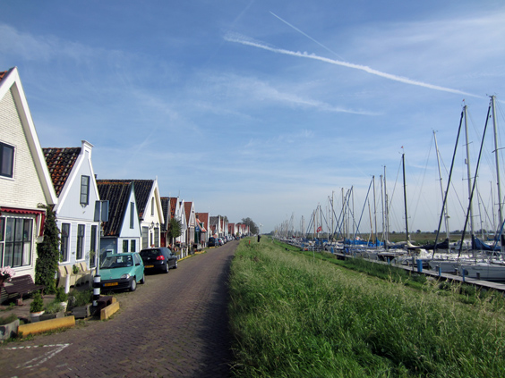
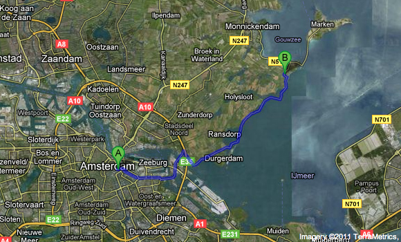
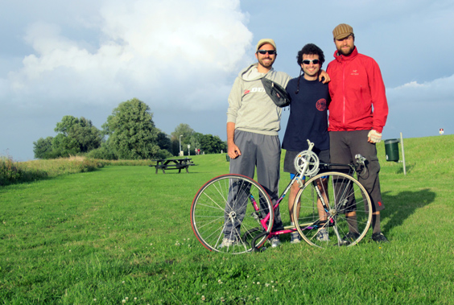

Another round, another bike ride, another fabulous convergence: three souls joined together, no less! Martino, John and I gathered at our Oudeschans fort and left direction East. John is our bike guru, our reference, so we gladly left him the lead and followed his suggestion: Marken would be our destination. 

Marken is a very special town: a former fishermen island, it is now joined to the mainland by a thin strip of land. I guess it could be as famous as Mont St. Michael if only it wasn't as flat as the rest of the country. Oh well...

We had just left Amsterdam when we cycled along lovely Durgerdam. The village is actually a single line of houses along the coast, and despite being so close to the burstling capital, it somehow preserves the spirit of a laid-back little harbor. 

Oh, and let me anticipate something: we never reached Marken.

Cycling along the coast was really beutiful (although very windy). The trail stays basically all the time on a narrow dyke that separates the inland fileds and farms from the massive water on the right. It is quite impressive to notice the water level difference between the sea and the little canals and lakes just ten meters across; it makes you wonder what would be of this country if a hole would open in the dyke.

Now we get to the adventourous part: we were almost at the beginning of the little strip of land before Marken, when my chain snapped in two! My father once told me that he would enroll me at a cycling competition should I ever be able to break a chain. Well, I finally made it! (Not that I spent 30 years trying though).

Martino and I looked upon John--he's the tool master, he has for sure a prompt solution! Unfortunately he'd left home the tool we needed, so I ended up being pulled from Martino for two more kilometers until the bus stop. I took the wheels apart to let the bike better fit in the bus which took me right back to the Oudeschans where the adventure had begun. Martino and John rode back and arrived shortly after me, and a few laughihg frozen pizzas settled another cycling adventure.

