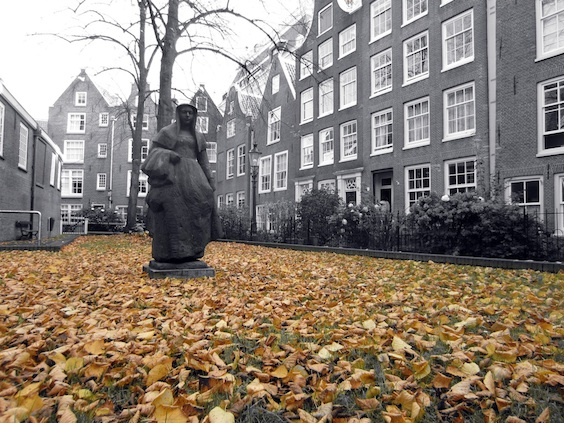

The [Begijnhof](http://www.transparent.com/dutch/de-begijnhof-amsterdam/) will stun you as you walk in. Former house of a semi-monastic Roman Catholic community, it's a silent and peaceful courtyard ten steps away from Amsterdam's loudest streets, the Spui and Kalverstraat. But I bet that the statues in there hear the feeble noise from the street life outside at night and feel lonesome.